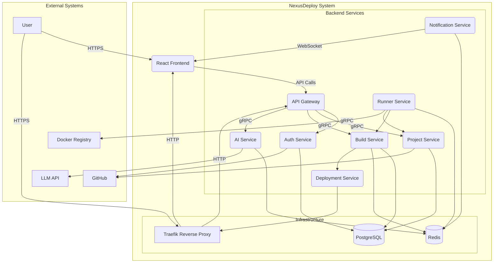
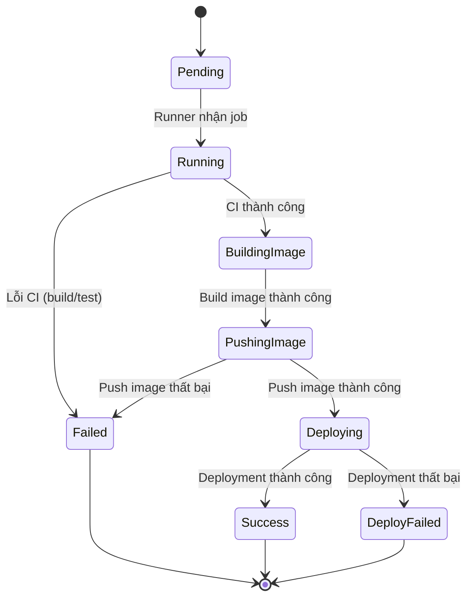

# Tài liệu SRS Môn thực tập tốt nghiệp - Nền tảng PaaS Mini tích hợp AI phân tích lỗi

**Phiên bản:** 1.0

---

**Thông tin chung:**

- **Tên đề tài:** NỀN TẢNG PAAS MINI TÍCH HỢP AI PHÂN TÍCH LỖI
- **Giảng viên hướng dẫn:** Thạc sĩ Nguyễn Văn Chiến
- **Sinh viên thực hiện:** Nguyễn Vương Minh Khôi
- **MSSV:** 22H1120108
- **Lớp:** CN22CLCD
- **GitHub:** [https://github.com/Khoi1909/NexusDeploy](https://github.com/Khoi1909/NexusDeploy)

---

## MỤC LỤC

- [CHƯƠNG 1. GIỚI THIỆU](#chương-1-giới-thiệu)
  - [1.1. Mục đích](#11-mục-đích)
  - [1.2. Phạm vi dự án](#12-phạm-vi-dự-án)
  - [1.3. Đối tượng dự kiến](#13-đối-tượng-dự-kiến)
  - [1.4. Định nghĩa, Thuật ngữ và Viết tắt](#14-định-nghĩa-thuật-ngữ-và-viết-tắt)
  - [1.5. Tổng quan tài liệu](#15-tổng-quan-tài-liệu)
- [CHƯƠNG 2. MÔ TẢ TỔNG QUAN](#chương-2-mô-tả-tổng-quan)
  - [2.1. Bối cảnh sản phẩm (Product Perspective)](#21-bối-cảnh-sản-phẩm-product-perspective)
  - [2.2. Tác nhân và Người dùng (Actors and Users)](#22-tác-nhân-và-người-dùng-actors-and-users)
  - [2.3. Sơ đồ Use Case tổng quan](#23-sơ-đồ-use-case-tổng-quan)
  - [2.4. Các giả định (Assumptions)](#24-các-giả-định-assumptions)
  - [2.5. Các ràng buộc (Constraints)](#25-các-ràng-buộc-constraints)
- [CHƯƠNG 3. YÊU CẦU CHỨC NĂNG (FUNCTIONAL REQUIREMENTS)](#chương-3-yêu-cầu-chức-năng-functional-requirements)
  - [3.1. FR1: Quản lý Xác thực (Authentication)](#31-fr1-quản-lý-xác-thực-authentication)
  - [3.2. FR2: Quản lý Dự án (Project Management)](#32-fr2-quản-lý-dự-án-project-management)
  - [3.3. FR3: Quản lý Biến môi trường (Secrets)](#33-fr3-quản-lý-biến-môi-trường-secrets)
  - [3.4. FR4: Quy trình Tích hợp & Triển khai (CI/CD Pipeline)](#34-fr4-quy-trình-tích-hợp--triển-khai-cicd-pipeline)
  - [3.5. FR5: Phân tích Lỗi bằng AI](#35-fr5-phân-tích-lỗi-bằng-ai)
  - [3.6. FR6: Hosting & Quản lý Vòng đời](#36-fr6-hosting--quản-lý-vòng-đời)
  - [3.7. FR7: Quản lý Gói đăng ký & Phân quyền (Plan & Permission)](#37-fr7-quản-lý-gói-đăng-ký--phân-quyền-plan--permission)
- [CHƯƠNG 4. YÊU CẦU PHI CHỨC NĂNG (NON-FUNCTIONAL REQUIREMENTS)](#chương-4-yêu-cầu-phi-chức-năng-non-functional-requirements)
  - [4.1. NFR1: Yêu cầu về Hiệu năng (Performance)](#41-nfr1-yêu-cầu-về-hiệu-năng-performance)
  - [4.2. NFR2: Yêu cầu về Bảo mật (Security)](#42-nfr2-yêu-cầu-về-bảo-mật-security)
  - [4.3. NFR3: Yêu cầu về Tính Sẵn sàng & Độ tin cậy (Availability & Reliability)](#43-nfr3-yêu-cầu-về-tính-sẵn-sàng--độ-tin-cậy-availability--reliability)
  - [4.4. NFR4: Yêu cầu về Tính Dễ sử dụng (Usability)](#44-nfr4-yêu-cầu-về-tính-dễ-sử-dụng-usability)
  - [4.5. NFR5: Yêu cầu về Giới hạn Tài nguyên (Resource Constraints)](#45-nfr5-yêu-cầu-về-giới-hạn-tài-nguyên-resource-constraints)

---

## CHƯƠNG 1. GIỚI THIỆU

### 1.1. Mục đích
Tài liệu này (SRS) đặc tả các yêu cầu về chức năng và phi chức năng cho dự án Nexus Deploy. Mục đích của tài liệu là cung cấp một mô tả chi tiết, rõ ràng và nhất quán về sản phẩm phần mềm sẽ được xây dựng.
Tài liệu này sẽ là cơ sở để:
- Định hướng quá trình thiết kế, lập trình và kiểm thử.
- Làm tài liệu tham chiếu và đánh giá cho giáo viên hướng dẫn.
- Thiết lập sự hiểu biết chung về các yêu cầu của dự án giữa các bên liên quan.

### 1.2. Phạm vi dự án
Nexus Deploy là một nền tảng Nền tảng như một Dịch vụ (PaaS - Platform-as-a-Service) hoàn chỉnh, được thiết kế để đơn giản hóa tối đa quy trình triển khai ứng dụng web cho lập trình viên.
Phạm vi của dự án bao gồm các chức năng chính sau:
1.  **Tích hợp GitHub:** Người dùng đăng nhập vào hệ thống bằng tài khoản GitHub (thông qua OAuth) và chọn các kho mã nguồn (repository) của họ để triển khai.
2.  **Tích hợp liên tục (CI):** Khi người dùng git push lên kho mã nguồn đã chọn, hệ thống sẽ tự động kích hoạt một quy trình (pipeline) build và test trong một môi trường Docker cô lập.
3.  **Hỗ trợ AI Phân tích Lỗi:** Nếu quy trình CI thất bại (build hoặc test lỗi), hệ thống sẽ cung cấp tính năng "Tell me why". Khi được kích hoạt, một Mô hình Ngôn ngữ Lớn (LLM) sẽ phân tích log lỗi và đưa ra gợi ý khắc phục.
4.  **Triển khai liên tục (CD) & Hosting:** Nếu quy trình CI thành công, hệ thống sẽ tự động build mã nguồn thành một Docker image, lưu trữ image và triển khai (host) ứng dụng dưới dạng một container.
5.  **Cung cấp Tên miền tự động:** Mỗi ứng dụng được triển khai thành công sẽ được tự động gán một tên miền con công khai (ví dụ: my-app.khqi.io.vn) với chứng chỉ SSL (HTTPS) hợp lệ.

Dự án này **không** bao gồm việc cung cấp dịch vụ cơ sở dữ liệu (Database-as-a-Service). Người dùng được yêu cầu kết nối đến các dịch vụ CSDL bên ngoài.

### 1.3. Đối tượng dự kiến
Tài liệu này dành cho các đối tượng sau:
- **Giáo viên hướng dẫn:** Để theo dõi, đánh giá và góp ý về phạm vi và tiến độ của đồ án.
- **Người phát triển (Developer):** Là người trực tiếp xây dựng dự án, dùng tài liệu này làm kim chỉ nam kỹ thuật.
- **Người kiểm thử (Tester):** Để thiết kế các kịch bản kiểm thử (test cases) dựa trên các yêu cầu chức năng.

### 1.4. Định nghĩa, Thuật ngữ và Viết tắt
- **PaaS (Platform-as-a-Service):** Nền tảng như một Dịch vụ.
- **CI (Continuous Integration):** Tích hợp liên tục.
- **CD (Continuous Deployment):** Triển khai liên tục.
- **SRS (Software Requirements Specification):** Đặc tả Yêu cầu Phần mềm.
- **LLM (Large Language Model):** Mô hình Ngôn ngữ Lớn (ví dụ: OpenAI, Anthropic).
- **OAuth (Open Authorization):** Giao thức ủy quyền mở, dùng để đăng nhập bằng GitHub.
- **gRPC:** Framework RPC hiệu năng cao do Google phát triển, dùng để giao tiếp giữa các microservice.
- **Runner Service:** Một microservice trong hệ thống, có nhiệm vụ thực thi các tác vụ CI/CD (build, test).
- **Traefik:** Một Reverse Proxy (Proxy ngược) hiện đại, dùng để tự động định tuyến tên miền và quản lý SSL.
- **Preset:** Một cấu hình định sẵn (ví dụ: Node.js, Go) mà người dùng chọn để hệ thống biết cách build và chạy dự án.
- **Secret:** Các biến môi trường bí mật (API keys, tokens) được mã hóa và lưu trữ.
- **GORM:** ORM (Object-Relational Mapping) cho Go, giúp tương tác với cơ sở dữ liệu.
- **Asynq:** Thư viện quản lý hàng đợi (job queue) cho Go, xây dựng trên Redis.
- **go-git:** Thư viện Go để đọc và thao tác với kho git.
- **Vite:** Công cụ build frontend hiện đại, tối ưu cho tốc độ phát triển.
- **TailwindCSS:** Framework CSS ưu tiên tiện ích (utility-first) để xây dựng giao diện nhanh chóng.

### 1.5. Tổng quan tài liệu
Tài liệu này được tổ chức thành các chương:
- **Chương 1 (Giới thiệu):** Cung cấp cái nhìn tổng quan, phạm vi, định nghĩa và mục đích của dự án.
- **Chương 2 (Mô tả tổng quan):** Mô tả các tác nhân (actors) liên quan, các giả định, ràng buộc, và kiến trúc hệ thống cấp cao.
- **Chương 3 (Yêu cầu chức năng):** Đặc tả chi tiết các tính năng mà hệ thống phải thực hiện.
- **Chương 4 (Yêu cầu phi chức năng):** Đặc tả các yêu cầu về hiệu năng, bảo mật, độ tin cậy và các ràng buộc kỹ thuật khác.

---

## CHƯƠNG 2. MÔ TẢ TỔNG QUAN

### 2.1. Bối cảnh sản phẩm (Product Perspective)
Nexus Deploy là một hệ thống web độc lập, hoạt động như một nền tảng PaaS hoàn chỉnh. Nó được thiết kế để tự động hóa toàn bộ quy trình từ mã nguồn (git push) đến một ứng dụng web đang chạy (HTTPS URL).
Hệ thống sẽ tương tác và phụ thuộc vào các thành phần bên ngoài sau:
- **GitHub:** Dùng làm nhà cung cấp xác thực (OAuth) và nguồn mã nguồn. Nexus Deploy sử dụng API của GitHub để liệt kê kho (repo) và tự động cài đặt Webhook.
- **Traefik:** Đóng vai trò là Reverse Proxy (Proxy ngược) ở tầng biên, chịu trách nhiệm định tuyến các tên miền con (subdomain) đến đúng container ứng dụng và tự động quản lý chứng chỉ SSL.
- **Docker Engine:** Môi trường thực thi lỗi. Nexus Deploy sử dụng Docker SDK for Go để tạo, quản lý và hủy các container một cách cô lập cho cả quá trình CI (build/test) và CD (host).
- **LLM API (External):** Một dịch vụ Mô hình Ngôn ngữ Lớn bên ngoài (như Gemini hoặc GPT) được gọi để thực hiện chức năng phân tích log lỗi.

### 2.2. Tác nhân và Người dùng (Actors and Users)
Hệ thống có hai tác nhân chính:

| Tác nhân | Mô tả |
| :--- | :--- |
| **Developer (Lập trình viên)** | Là người dùng cuối của Nexus Deploy. Họ muốn triển khai ứng dụng của mình một cách nhanh chóng. |
| **GitHub (Hệ thống)** | Là hệ thống bên ngoài, có nhiệm vụ thông báo cho Nexus Deploy mỗi khi có sự kiện git push mới. |

### 2.3. Sơ đồ Use Case tổng quan
Sơ đồ này mô tả các tương tác cấp cao của tác nhân "Developer" với hệ thống Nexus Deploy.
*(Nội dung hình ảnh về Use Case sẽ được cập nhật sau)*

### 2.4. Các giả định (Assumptions)
1.  **Hạ tầng:** Hệ thống được giả định chạy trên một máy chủ (Server) đã được cài đặt sẵn Docker, Docker SDK (cho Go), và Traefik.
2.  **DNS:** Tên miền chính (ví dụ: khqi.io.vn) và bản ghi Wildcard (*.khqi.io.vn) đã được trỏ chính xác đến IP của máy chủ.
3.  **Kiến thức Người dùng:** Người dùng (Developer) có kiến thức cơ bản về Git và hiểu cách tổ chức một dự án web (ví dụ: biết các lệnh build/start).
4.  **Phạm vi Ứng dụng:** Các dự án được triển khai là ứng dụng web dựa trên giao thức HTTP/HTTPS.
5.  **Tài khoản:** Người dùng bắt buộc phải có tài khoản GitHub.

### 2.5. Các ràng buộc (Constraints)
1.  **Công nghệ (Tech Stack):**
    - **Backend (Go Microservices):**
        - Ngôn ngữ: Go 1.21+
        - Kiến trúc: Microservices (8 services)
        - Giao tiếp: gRPC (nội bộ), REST API (bên ngoài), WebSocket (real-time)
        - ORM: GORM
        - Hàng đợi (Queue): Redis + Asynq
        - Tương tác Git: go-git
    - **Frontend:**
        - Framework: React 18 (sử dụng Vite)
        - Styling: TailwindCSS
        - Quản lý State: Zustand/Redux
    - **Cơ sở hạ tầng:**
        - CSDL: PostgreSQL 15+
        - Cache/Queue: Redis 7+
        - Reverse Proxy: Traefik 2.x
2.  **Hạ tầng (Infrastructure):**
    - Toàn bộ hệ thống (CI/CD, Hosting) phải chạy trên nền tảng Docker.
    - Hệ thống bắt buộc phụ thuộc vào Traefik để xử lý định tuyến và SSL.
3.  **Bảo mật (Security):**
    - Tất cả các "Secrets" (biến môi trường bí mật) của người dùng phải được mã hóa (ví dụ: AES-256) trước khi lưu vào cơ sở dữ liệu.
    - Các container của người dùng phải được chạy trong một mạng Docker riêng (isolated network) và không có đặc quyền (non-privileged) để đảm bảo an toàn.
4.  **Tài nguyên (Resources):**
    - Hệ thống phải có khả năng giới hạn tài nguyên (RAM, CPU) cho mỗi container ứng dụng của người dùng (dựa trên Gói đăng ký - Plan).
5.  **API Bên ngoài (External APIs):**
    - Hệ thống phụ thuộc vào tính khả dụng của GitHub API (cho OAuth, Webhook) và LLM API (cho phân tích lỗi). Nếu các API này gặp sự cố, các tính năng liên quan sẽ bị gián đoạn.
6.  **Service Discovery & Observability:**
    - **Service Discovery:** Các service nội bộ sẽ tìm thấy nhau thông qua Docker Compose DNS resolution (ví dụ: `http://auth-service:8001`).
    - **Health Checks:** Mỗi service phải cung cấp ít nhất 2 endpoint: `/health` (liveness probe) và `/ready` (readiness probe).
    - **Metrics:** Mỗi service nên cung cấp endpoint `/metrics` theo format của Prometheus để phục vụ cho việc giám sát.

### 2.6. System Architecture Diagram

Sơ đồ dưới đây cung cấp cái nhìn tổng quan về kiến trúc của hệ thống NexusDeploy.



---

## CHƯƠNG 3. YÊU CẦU CHỨC NĂNG (FUNCTIONAL REQUIREMENTS)

### 3.0. Service Boundaries Matrix

Phần này định nghĩa ranh giới và quyền hạn của từng service để đảm bảo tính chuyên biệt và giảm coupling.

| Service | CÓ QUYỀN (CAN) | KHÔNG CÓ QUYỀN (CANNOT) |
| :--- | :--- | :--- |
| **Auth Service** | - CRUD và quản lý `users`, `tokens` trong `auth_db`.<br>- Xử lý logic GitHub OAuth.<br>- Tạo, xác thực, và thu hồi JWT.<br>- Expose gRPC service cho các service khác. | - Truy cập `project_db` hoặc `build_db`.<br>- Gọi các service nội bộ khác.<br>- Biết về logic build, deployment, hay project. |
| **Project Service** | - CRUD và quản lý `projects`, `secrets`, `webhooks` trong `project_db`.<br>- Gọi GitHub API để quản lý repositories và webhooks.<br>- Mã hóa và giải mã secrets. | - Truy cập `auth_db` hoặc `build_db`.<br>- Gọi trực tiếp `Deployment Service` hoặc `Runner Service`.<br>- Thực thi build/test. |
| **Build Service** | - CRUD và quản lý `builds`, `build_logs` trong `build_db`.<br>- Điều phối (orchestrate) luồng CI/CD.<br>- Đẩy job vào Redis Queue.<br>- Gọi `Deployment Service` để kích hoạt deployment. | - Truy cập `auth_db` hoặc `project_db` trực tiếp.<br>- Thực thi các lệnh Docker.<br>- Tương tác trực tiếp với GitHub API. |
| **Runner Service** | - Lắng nghe job từ Redis Queue.<br>- Thực thi các lệnh Docker (build, test, push).<br>- Gọi `Project Service` để lấy config/secrets.<br>- Gọi `Build Service` để cập nhật trạng thái.<br>- Publish logs lên Redis Pub/Sub. | - Truy cập trực tiếp bất kỳ database nào.<br>- Có state riêng (phải là stateless worker).<br>- Điều phối luồng CI/CD. |
| **Deployment Svc** | - Thực thi các lệnh Docker (pull, run, stop, rm).<br>- Gán labels cho Traefik.<br>- Đọc "Deployment Spec" được truyền vào. | - Gọi `Project Service` hoặc `Auth Service` trực tiếp.<br>- Quyết định resource limits (phải nhận từ spec).<br>- Truy cập `build_db`. |
| **AI Service** | - Gọi `Build Service` để lấy logs.<br>- Gọi LLM API bên ngoài.<br>- Cache kết quả vào Redis. | - Truy cập bất kỳ database nào trực tiếp.<br>- Biết về cấu hình project chi tiết.<br>- Lưu trữ log dài hạn. |
| **Notification Svc**| - Quản lý WebSocket connections.<br>- Lắng nghe các kênh Redis Pub/Sub.<br>- Broadcast messages cho clients. | - Có state hoặc logic nghiệp vụ.<br>- Gọi các gRPC service khác.<br>- Truy cập bất kỳ database nào. |
| **API Gateway** | - Định tuyến HTTP requests.<br>- Xác thực JWT bằng cách gọi `Auth Service`.<br>- Rate limiting, CORS.<br>- Chuyển tiếp request đến các gRPC service. | - Chứa bất kỳ logic nghiệp vụ nào.<br>- Truy cập trực tiếp bất kỳ database nào.<br>- Lưu trữ state. |

### 3.1. FR1: Quản lý Xác thực (Authentication)

**Service chịu trách nhiệm chính:** `Auth Service`

| ID | Yêu cầu | Mô tả chi tiết |
| :--- | :--- | :--- |
| **FR1.1** | Đăng nhập bằng GitHub | - **Mô tả:** Giao diện Frontend điều hướng người dùng đến `API Gateway`, Gateway chuyển hướng đến `Auth Service` để bắt đầu luồng GitHub OAuth.<br>- **Chi tiết kỹ thuật:** `Auth Service` tạo và quản lý `state` parameter để chống CSRF. |
| **FR1.2** | Xử lý Callback | - **Mô tả:** `Auth Service` cung cấp endpoint `/auth/github/callback` để nhận `authorization_code` từ GitHub.<br>- **Chi tiết kỹ thuật:** Endpoint phải xác thực `state` parameter trước khi xử lý. |
| **FR1.3** | Tạo phiên (Session) | - **Mô tả:** `Auth Service` trao đổi `code` để lấy `access_token` từ GitHub, sau đó tạo một JWT nội bộ và trả về cho Frontend.<br>- **Chi tiết kỹ thuật:** JWT chứa `user_id`, `plan`, và `exp`. `access_token` của GitHub được mã hóa và lưu vào `auth_db`. |
| **FR1.4** | Đăng xuất | - **Mô tả:** `Auth Service` cung cấp endpoint để vô hiệu hóa JWT.<br>- **Chi tiết kỹ thuật:** Sử dụng cơ chế blacklist trên Redis với key là JTI (JWT ID) và giá trị là thời gian hết hạn của token. |
| **FR1.5** | Đồng bộ thông tin | - **Mô tả:** Lần đầu đăng nhập, `Auth Service` dùng `access_token` để lấy thông tin user từ GitHub và lưu vào bảng `users` trong `auth_db`.<br>- **Chi tiết kỹ thuật:** Chỉ đồng bộ các thông tin cơ bản: `github_id`, `username`, `email`, `avatar`. |

### 3.2. FR2: Quản lý Dự án (Project Management)

**Service chịu trách nhiệm chính:** `Project Service`

| ID | Yêu cầu | Mô tả chi tiết |
| :--- | :--- | :--- |
| **FR2.1** | Thêm Dự án mới | - **Mô tả:** `Project Service` cung cấp gRPC method `CreateProject` để tạo một dự án mới trong `project_db`.<br>- **Chi tiết kỹ thuật:** Method này nhận `user_id`, `repo_url`, `preset` và các cấu hình ban đầu. |
| **FR2.2** | Liệt kê Kho (Repo) | - **Mô tả:** `Project Service` gọi GitHub API bằng `access_token` của user để lấy danh sách repositories.<br>- **Chi tiết kỹ thuật:** `access_token` được truyền từ `API Gateway` sau khi xác thực. `Project Service` không lưu trữ token này. |
| **FR2.3** | Cài đặt Webhook | - **Mô tả:** Khi tạo dự án, `Project Service` gọi GitHub API để tự động thêm một webhook, trỏ đến endpoint của `API Gateway`.<br>- **Chi tiết kỹ thuật:** Secret của webhook được tạo và lưu vào `project_db`. |
| **FR2.4** | Cấu hình Preset | - **Mô tả:** `Project Service` lưu trữ và quản lý cấu hình `preset` (ví dụ: Node.js, Go) cho mỗi dự án.<br>- **Chi tiết kỹ thuật:** Cấu hình này bao gồm các lệnh build/start mặc định. |
| **FR2.5** | Cấu hình Lệnh (UI) | - **Mô tả:** `Project Service` cho phép cập nhật các lệnh build và start tùy chỉnh cho một dự án.<br>- **Chi tiết kỹ thuật:** Các lệnh này được lưu trong bảng `projects` của `project_db`. |
| **FR2.6** | Cấu hình Port (Nâng cao) | - **Mô tả:** `Project Service` cho phép người dùng ghi đè port nội bộ của ứng dụng.<br>- **Chi tiết kỹ thuật:** Port này sẽ được `Deployment Service` sử dụng khi triển khai. |
| **FR2.7** | Xóa Dự án | - **Mô tả:** `Project Service` điều phối việc xóa dự án, bao gồm gọi `Deployment Service` để dừng container và gọi GitHub API để gỡ webhook.<br>- **Chi-tiết kỹ thuật:** Đây là một saga transaction đơn giản để đảm bảo tính nhất quán. |

### 3.3. FR3: Quản lý Biến môi trường (Secrets)

**Service chịu trách nhiệm chính:** `Project Service`

| ID | Yêu cầu | Mô tả chi tiết |
| :--- | :--- | :--- |
| **FR3.1** | Giao diện CRUD | - **Mô tả:** `Project Service` cung cấp các gRPC method để quản lý secrets (Add, Update, Delete).<br>- **Chi tiết kỹ thuật:** API được expose cho Frontend thông qua `API Gateway`. |
| **FR3.2** | Mã hóa tại Backend | - **Mô tả:** `Project Service` sử dụng một master key của hệ thống để mã hóa giá trị của secret bằng thuật toán AES-256-GCM trước khi lưu vào `project_db`.<br>- **Chi tiết kỹ thuật:** Master key được inject vào `Project Service` qua biến môi trường hoặc một hệ thống quản lý secret. |
| **FR3.3** | Che giấu Giá trị | - **Mô tả:** API của `Project Service` không bao giờ trả về giá trị secret đã giải mã cho client bên ngoài.<br>- **Chi tiết kỹ thuật:** API chỉ trả về tên secret và một giá trị placeholder (ví dụ: `**********`). |
| **FR3.4** | Tiêm (Inject) vào CI | - **Mô tả:** `Runner Service` gọi gRPC method `GetSecrets` của `Project Service` để lấy các secret đã được giải mã.<br>- **Chi tiết kỹ thuật:** Cuộc gọi này phải được xác thực (ví dụ: mTLS) để đảm bảo chỉ `Runner Service` mới có quyền truy cập. |
| **FR3.5** | Tiêm (Inject) vào Host | - **Mô tả:** `Build Service` (với vai trò orchestrator) gọi `Project Service` để lấy secrets và truyền chúng vào "Deployment Spec" cho `Deployment Service`.<br>- **Chi tiết kỹ thuật:** `Deployment Service` không gọi trực tiếp `Project Service`, giảm coupling. |

### 3.4. FR4: Quy trình Tích hợp & Triển khai (CI/CD Pipeline)

**Service điều phối chính (Orchestrator):** `Build Service`

| ID | Yêu cầu | Mô tả chi tiết |
| :--- | :--- | :--- |
| **FR4.1** | Kích hoạt (Trigger) | - **Mô tả:** `API Gateway` nhận webhook từ GitHub, xác thực và chuyển tiếp đến `Build Service` để bắt đầu quy trình.<br>- **Service liên quan:** `API Gateway`, `Build Service`. |
| **FR4.2** | Tạo Tác vụ (Job) | - **Mô tả:** `Build Service` tạo một bản ghi build trong `build_db` và đẩy một job message chứa `build_id` vào Redis Queue.<br>- **Chi tiết kỹ thuật:** Job message là một JSON payload được định nghĩa rõ ràng. |
| **FR4.3** | Nhận Tác vụ (Runner) | - **Mô tả:** `Runner Service` lắng nghe queue, nhận job, và gọi `Build Service` để cập nhật trạng thái build thành "Running".<br>- **Service liên quan:** `Runner Service`, `Build Service`. |
| **FR4.4** | Giai đoạn CI (Build/Test) | - **Mô tả:** `Runner Service` thực thi các lệnh build/test trong một container Docker cô lập.<br>- **Chi tiết kỹ thuật:** `Runner` gọi `Project Service` để lấy cấu hình và secrets trước khi bắt đầu. |
| **FR4.5** | Truyền Log (Build) | - **Mô tả:** `Runner Service` publish log output lên một kênh Redis Pub/Sub.<br>- **Chi tiết kỹ thuật:** `Notification Service` lắng nghe kênh này để stream log đến client. |
| **FR4.6** | Xử lý CI Thất bại | - **Mô tả:** Nếu CI thất bại, `Runner Service` gọi `Build Service` để cập nhật trạng thái build thành "Failed" và gửi toàn bộ log.<br>- **Chi tiết kỹ thuật:** `Build Service` lưu log vào `build_db`. |
| **FR4.7** | Giai đoạn CD (Build Image) | - **Mô tả:** Nếu CI thành công, `Runner Service` build Docker image cho ứng dụng.<br>- **Service liên quan:** `Runner Service`. |
| **FR4.8** | Đẩy Image (Push) | - **Mô tả:** `Runner Service` đẩy image vừa build lên Docker Registry.<br>- **Service liên quan:** `Runner Service`. |
| **FR4.9** | Giai đoạn CD (Host) | - **Mô tả:** `Runner Service` báo cho `Build Service` rằng image đã sẵn sàng. `Build Service` sau đó tạo "Deployment Spec" và gọi `Deployment Service` để bắt đầu triển khai.<br>- **Chi tiết kỹ thuật:** `Build Service` đóng vai trò điều phối, quyết định khi nào bắt đầu deployment. |
| **FR4.10**| Hoàn tất Tác vụ | - **Mô tả:** `Deployment Service` báo cáo kết quả triển khai cho `Build Service`. `Build Service` cập nhật trạng thái cuối cùng của build là "Success" hoặc "DeployFailed".<br>- **Service liên quan:** `Deployment Service`, `Build Service`. |

#### 3.4.1. Build State Machine

Sơ đồ dưới đây mô tả các trạng thái và sự chuyển đổi của một build job, được quản lý bởi `Build Service`.



### 3.5. FR5: Phân tích Lỗi bằng AI

**Service chịu trách nhiệm chính:** `AI Service`

| ID | Yêu cầu | Mô tả chi tiết |
| :--- | :--- | :--- |
| **FR5.1** | Kích hoạt (UI) | - **Mô tả:** Giao diện Frontend hiển thị nút "Tell me why" cho các build có trạng thái "Failed".<br>- **Service liên quan:** (Frontend). |
| **FR5.2** | Gửi Yêu cầu AI | - **Mô tả:** Frontend gọi API của `API Gateway` để yêu cầu phân tích lỗi cho một `build_id`.<br>- **Service liên quan:** `API Gateway`. |
| **FR5.3** | Xử lý (Backend) | - **Mô tả:** `API Gateway` gọi `Auth Service` để kiểm tra quyền, sau đó chuyển tiếp yêu cầu đến `AI Service`. `AI Service` gọi `Build Service` để lấy log của `build_id` tương ứng.<br>- **Service liên quan:** `API Gateway`, `Auth Service`, `AI Service`, `Build Service`. |
| **FR5.4** | Gọi LLM API | - **Mô tả:** `AI Service` xây dựng một prompt chi tiết từ log lỗi và gọi API của LLM bên ngoài.<br>- **Chi tiết kỹ thuật:** Prompt engineering là một phần quan trọng của service này. |
| **FR5.5** | Phân cấp Gói (Standard) | - **Mô tả:** Dựa trên thông tin plan từ `Auth Service`, `AI Service` điều chỉnh prompt để LLM chỉ trả về gợi ý chung.<br>- **Service liên quan:** `AI Service`, `Auth Service`. |
| **FR5.6** | Phân cấp Gói (Premium) | - **Mô tả:** Với gói "Premium", `AI Service` sử dụng một prompt khác để yêu cầu LLM cung cấp đề xuất sửa lỗi chi tiết.<br>- **Service liên quan:** `AI Service`, `Auth Service`. |
| **FR5.7** | Hiển thị Kết quả | - **Mô tả:** `AI Service` xử lý và trả kết quả về cho `API Gateway` để hiển thị trên Frontend.<br>- **Chi tiết kỹ thuật:** `AI Service` nên có cơ chế cache kết quả trên Redis để giảm chi phí và độ trễ. |

### 3.6. FR6: Hosting & Quản lý Vòng đời

**Service chịu trách nhiệm chính:** `Deployment Service`

| ID | Yêu cầu | Mô tả chi tiết |
| :--- | :--- | :--- |
| **FR6.1** | Kích hoạt Triển khai | - **Mô tả:** `Deployment Service` nhận một "Deployment Spec" từ `Build Service` để bắt đầu quá trình triển khai.<br>- **Chi tiết kỹ thuật:** Spec chứa tất cả thông tin cần thiết: image, tag, secrets, resource limits. |
| **FR6.2** | Dọn dẹp Container cũ | - **Mô tả:** Trước khi triển khai phiên bản mới, `Deployment Service` sẽ dừng và xóa container cũ nếu có.<br>- **Chi tiết kỹ thuật:** Cần có cơ chế kiểm tra health check của container mới trước khi xóa container cũ để đảm bảo zero-downtime. |
| **FR6.3** | Chạy Container mới | - **Mô tả:** `Deployment Service` sử dụng Docker SDK để pull image và chạy container mới.<br>- **Service liên quan:** `Deployment Service`. |
| **FR6.4** | Tiêm Biến (Host) | - **Mô tả:** Tất cả biến môi trường và secrets được truyền vào container thông qua "Deployment Spec".<br>- **Chi tiết kỹ thuật:** `Deployment Service` không cần gọi các service khác, giảm coupling. |
| **FR6.5** | Gán Nhãn (Labels) | - **Mô tả:** `Deployment Service` gán các labels của Traefik vào container để cấu hình routing và SSL tự động.<br>- **Service liên quan:** `Deployment Service`. |
| **FR6.6** | Giới hạn Tài nguyên | - **Mô tả:** Các giới hạn về RAM/CPU được định nghĩa trong "Deployment Spec" và được `Deployment Service` áp dụng khi chạy container.<br>- **Service liên quan:** `Deployment Service`. |
| **FR6.7** | Xem Log (Runtime) | - **Mô tả:** `Deployment Service` thu thập log từ container và publish lên Redis Pub/Sub.<br>- **Chi tiết kỹ thuật:** `Notification Service` lắng nghe kênh này để stream log đến client, thống nhất với cơ chế build log. |
| **FR6.8** | Khởi động lại (Restart) | - **Mô tả:** `Deployment Service` cung cấp API để restart một container.<br>- **Service liên quan:** `Deployment Service`. |
| **FR6.9** | Dừng (Stop) | - **Mô tả:** `Deployment Service` cung cấp API để dừng và xóa một container đang chạy.<br>- **Service liên quan:** `Deployment Service`. |

### 3.7. FR7: Quản lý Gói đăng ký & Phân quyền (Plan & Permission)

**Service chịu trách nhiệm chính:** `Auth Service`

| ID | Yêu cầu | Mô tả chi tiết |
| :--- | :--- | :--- |
| **FR7.1** | Định nghĩa Gói | - **Mô tả:** `Auth Service` là nơi định nghĩa các cấp độ gói và các giới hạn tương ứng (số dự án, build đồng thời, RAM, CPU).<br>- **Chi tiết kỹ thuật:** Thông tin này có thể được lưu trong `auth_db` hoặc file config của `Auth Service`. |
| **FR7.2** | Gói Mặc định | - **Mô tả:** Khi user mới đăng ký, `Auth Service` tự động gán cho họ gói "Standard".<br>- **Service liên quan:** `Auth Service`. |
| **FR7.3** | Bảng Phân quyền | - **Mô tả:** `Auth Service` cung cấp gRPC method `GetUserPlan` để các service khác có thể truy vấn thông tin gói và quyền của user.<br>- **Service liên quan:** `Auth Service`. |
| **FR7.4** | Thực thi Phân quyền | - **Mô tả:** Các service khác có trách nhiệm gọi `Auth Service` để kiểm tra quyền trước khi thực hiện hành động.<br>- **Chi tiết kỹ thuật:** `Build Service` kiểm tra số build đồng thời. `Deployment Service` áp dụng giới hạn tài nguyên. `AI Service` kiểm tra quyền truy cập tính năng. |
| **FR7.5** | Giao diện Nâng cấp | - **Mô tả:** Frontend hiển thị trang mô tả các gói. Luồng nâng cấp thực tế (tích hợp thanh toán) nằm ngoài phạm vi dự án.<br>- **Service liên quan:** (Frontend). |

### 3.8. Error Handling & Fault Tolerance

Bảng này định nghĩa cách hệ thống xử lý các kịch bản lỗi quan trọng giữa các service.

| Service Call | Kịch bản lỗi (Error Case) | Hành động (Action) | Chính sách Retry | Thông báo cho User (English) |
| :--- | :--- | :--- | :--- | :--- |
| Runner → Project.GetSecrets | Service trả lỗi 500 | Đánh dấu build "Failed" | 3 lần, exponential backoff | "Build failed: A system configuration error occurred." |
| Runner → Project.GetSecrets | Project Service không thể truy cập | Đánh dấu build "Failed" | 3 lần, exponential backoff | "Build failed: A system configuration error occurred." |
| Build → Deployment.Deploy | Deployment Service không phản hồi | Giữ build ở trạng thái "Deploying" | Không tự động retry | "Deployment is queued and will start shortly..." |
| Bất kỳ service nào → GitHub API | API bị rate limit | Tạm dừng hành động, chờ | Retry sau 1 phút | "GitHub API is busy. Please try again in a few moments." |
| Bất kỳ service nào → Database | Mất kết nối CSDL | Service chuyển sang trạng thái unhealthy, từ chối request mới | Retry kết nối ở background | (No direct notification) System returns a 5xx error. |
| Deployment Service | Container mới crash sau khi start | Rollback về container cũ (nếu có) | Không retry | "Deployment failed. Rolling back to the previous version." |

### 3.9. Sample API Contracts

Phần này cung cấp các ví dụ về định nghĩa API contract sử dụng cú pháp Protocol Buffers (Protobuf) cho các gRPC method quan trọng.

**1. Auth.ValidateToken**

```protobuf
// auth.proto
service AuthService {
  rpc ValidateToken(ValidateTokenRequest) returns (ValidateTokenResponse);
}

message ValidateTokenRequest {
  string jwt = 1;
}

message ValidateTokenResponse {
  string user_id = 1;
  string plan = 2;
  bool is_valid = 3;
}
```

**2. Project.GetSecrets**

```protobuf
// project.proto
service ProjectService {
  rpc GetSecrets(GetSecretsRequest) returns (GetSecretsResponse);
}

message GetSecretsRequest {
  string project_id = 1;
}

message GetSecretsResponse {
  map<string, string> secrets = 1;
}
```

**3. Build.UpdateBuildStatus**

```protobuf
// build.proto
service BuildService {
  rpc UpdateBuildStatus(UpdateBuildStatusRequest) returns (UpdateBuildStatusResponse);
}

message UpdateBuildStatusRequest {
  string build_id = 1;
  string status = 2; // e.g., "RUNNING", "FAILED", "SUCCESS"
  repeated string log_lines = 3; // Chỉ gửi log khi build fail
}

message UpdateBuildStatusResponse {
  bool acknowledged = 1;
}
```

---


### 3.2. Mô hình Giao tiếp Giữa Các Service

Bảng này định nghĩa các mẫu giao tiếp chính. 

| Từ Service | Đến Service | Giao thức | Kiểu | Mục đích | Timeout | Retry Policy |
| :--- | :--- | :--- | :--- | :--- | :--- | :--- |
| API Gateway | Auth Service | gRPC | Sync | Xác thực token, lấy thông tin user | 5s | 3 lần, exponential backoff |
| API Gateway | Project Service | gRPC | Sync | CRUD dự án, secrets | 10s | 3 lần, exponential backoff |
| API Gateway | Build Service | gRPC | Sync | Lấy lịch sử build | 10s | 3 lần, exponential backoff |
| Build Service | Redis | - | Async | Đẩy job vào queue | N/A | N/A |
| Runner Service | Redis | - | Async | Lắng nghe job từ queue | N/A | N/A |
| Runner Service | Build Service | gRPC | Sync | Cập nhật trạng thái build | 5s | 5 lần, linear backoff |
| Runner Service | Project Service | gRPC | Sync | Lấy secrets và cấu hình | 10s | 3 lần, exponential backoff |
| Runner Service | Redis Pub/Sub | - | Async | Publish logs | N/A | N/A |
| Notification Svc | Redis Pub/Sub | - | Async | Lắng nghe logs và events | N/A | N/A |
| Build Service | Deployment Svc | gRPC | Sync | Kích hoạt deployment | 30s | Không retry |
| AI Service | Build Service | gRPC | Sync | Lấy logs của build | 15s | 3 lần, linear backoff |
| Deployment Svc | Auth Service | gRPC | Sync | Lấy resource limits | 5s | 3 lần, exponential backoff |

---


---

## CHƯƠNG 4. YÊU CẦU PHI CHỨC NĂNG (NON-FUNCTIONAL REQUIREMENTS)

### 4.1. NFR1: Yêu cầu về Hiệu năng (Performance)

| ID | Yêu cầu | Mô tả chi tiết |
| :--- | :--- | :--- |
| **NFR1.1**| Phản hồi Giao diện (UI) | Thời gian tải các trang chính (Dashboard, Project Settings) phải dưới 2 giây. Các tương tác API (ví dụ: lưu Secrets) phải phản hồi cho người dùng dưới 500ms. |
| **NFR1.2**| Kích hoạt Tác vụ (Job Trigger) | Thời gian từ lúc hệ thống nhận được Webhook `git push` (hợp lệ) đến lúc Job được đưa vào hàng đợi (Redis) và Runner bắt đầu nhận việc phải dưới 5 giây. |
| **NFR1.3**| Xử lý Đồng thời | Hệ thống (Runner Service pool) phải có khả năng xử lý đồng thời nhiều job CI/CD, tuân thủ theo giới hạn của gói đăng ký (tham chiếu FR7.3). |
| **NFR1.4**| Truyền Log (Real-time) | Log (cả build-time và run-time) phải được stream (luồng) đến giao diện người dùng qua WebSocket với độ trễ dưới 1 giây để đảm bảo trải nghiệm theo dõi thời gian thực. |

### 4.2. NFR2: Yêu cầu về Bảo mật (Security)

| ID | Yêu cầu | Mô tả chi tiết |
| :--- | :--- | :--- |
| **NFR2.1**| Mã hóa Dữ liệu Nhạy cảm | Tất cả các `access_token` của GitHub và `Value` của Secrets (tham chiếu FR3.2) **bắt buộc** phải được mã hóa (ví dụ: AES-256-GCM) trước khi lưu trữ vào cơ sở dữ liệu. |
| **NFR2.2**| Cách ly Container | Các container ứng dụng của người dùng (cả CI và Host) **bắt buộc** phải chạy trong một mạng Docker riêng (isolated network) và không có đặc quyền (`--privileged=false`) để ngăn chặn leo thang đặc quyền (privilege escalation) vào máy chủ (tham chiếu Ràng buộc 2.5). |
| **NFR2.3**| Xác thực Webhook | Endpoint nhận Webhook từ GitHub (tham chiếu FR4.1) **bắt buộc** phải xác thực chữ ký (signature) của payload (sử dụng một "secret" được chia sẻ) để đảm bảo yêu cầu thực sự đến từ GitHub và không bị giả mạo. |
| **NFR2.4**| Bảo mật Web | Giao diện Web (Frontend) và API (Backend) phải được bảo vệ khỏi các lỗ hổng web phổ biến (OWASP Top 10), bao gồm: XSS (Cross-Site Scripting) và CSRF (Cross-Site Request Forgery). |

### 4.3. NFR3: Yêu cầu về Tính Sẵn sàng & Độ tin cậy (Availability & Reliability)

| ID | Yêu cầu | Mô tả chi tiết |
| :--- | :--- | :--- |
| **NFR3.1**| Tính Sẵn sàng (Uptime) | Trang Dashboard và các ứng dụng đang được host của người dùng phải có tính sẵn sàng cao (mục tiêu 99.9%). Traefik phải được cấu hình để tự động khởi động lại. |
| **NFR3.2**| Xử lý Lỗi Bên ngoài | Nếu các API bên ngoài (GitHub, LLM) không khả dụng hoặc trả lỗi (ví dụ: 500, 429), hệ thống Nexus Deploy không được sập (crash). Thay vào đó, hệ thống phải ghi nhận lỗi và hiển thị thông báo thân thiện cho người dùng. |
| **NFR3.3**| Khôi phục Runner | Nếu một tác vụ (Runner Service) đang chạy dở (Running) bị sập (crash), tác vụ đó sẽ được đánh dấu là "Failed". Hệ thống sẽ không tự động thử lại (để tránh các vòng lặp build lỗi). Người dùng phải tự kích hoạt lại quy trình (ví dụ: bằng cách push một commit mới hoặc nhấn nút "Re-deploy" trên UI). |

### 4.4. NFR4: Yêu cầu về Tính Dễ sử dụng (Usability)

| ID | Yêu cầu | Mô tả chi tiết |
| :--- | :--- | :--- |
| **NFR4.1**| Luồng Triển khai | Luồng triển khai một dự án mới (từ lúc chọn repo đến lúc có link) phải trực quan, rõ ràng và không yêu cầu người dùng cấu hình các thông số kỹ thuật phức tạp (như port, trừ khi ở chế độ nâng cao - FR2.6). |
| **NFR4.2**| Trạng thái Hệ thống | Giao diện phải luôn hiển thị rõ ràng trạng thái của dự án (Pending, Running, Success, Failed) và trạng thái của ứng dụng (Đang chạy, Đã dừng). |
| **NFR4.3**| Phản hồi Lỗi (AI) | Khi build thất bại, hệ thống phải cung cấp khả năng phân tích lỗi (tham chiếu FR5), giúp người dùng (đặc biệt là người mới) chẩn đoán sự cố dễ dàng hơn thay vì chỉ đọc log thô. |

### 4.5. NFR5: Yêu cầu về Giới hạn Tài nguyên (Resource Constraints)

| ID | Yêu cầu | Mô tả chi tiết |
| :--- | :--- | :--- |
| **NFR5.1**| Thực thi Giới hạn | Hệ thống **bắt buộc** phải thực thi chính xác các giới hạn về tài nguyên (RAM, CPU) cho các container host (tham chiếu FR6.6) và các giới hạn nghiệp vụ (số dự án, build đồng thời) dựa trên Gói đăng ký của người dùng (tham chiếu FR7). |
