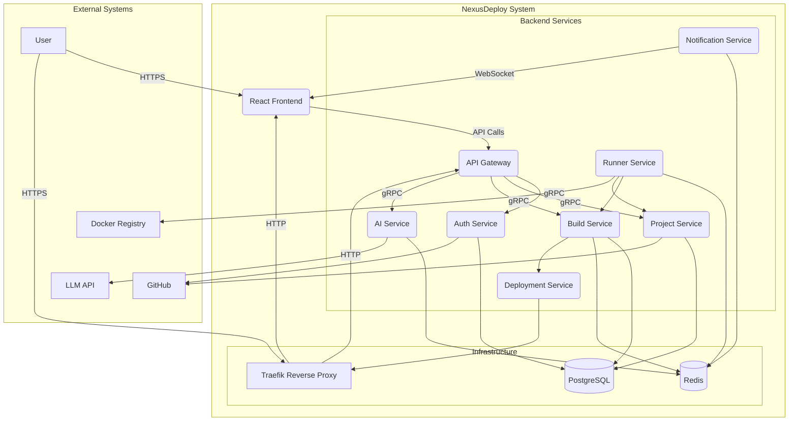
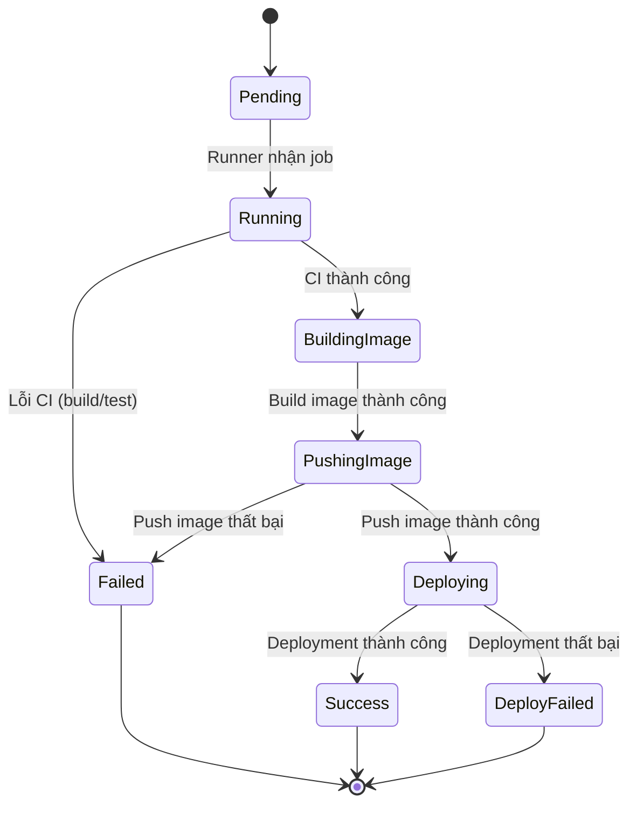
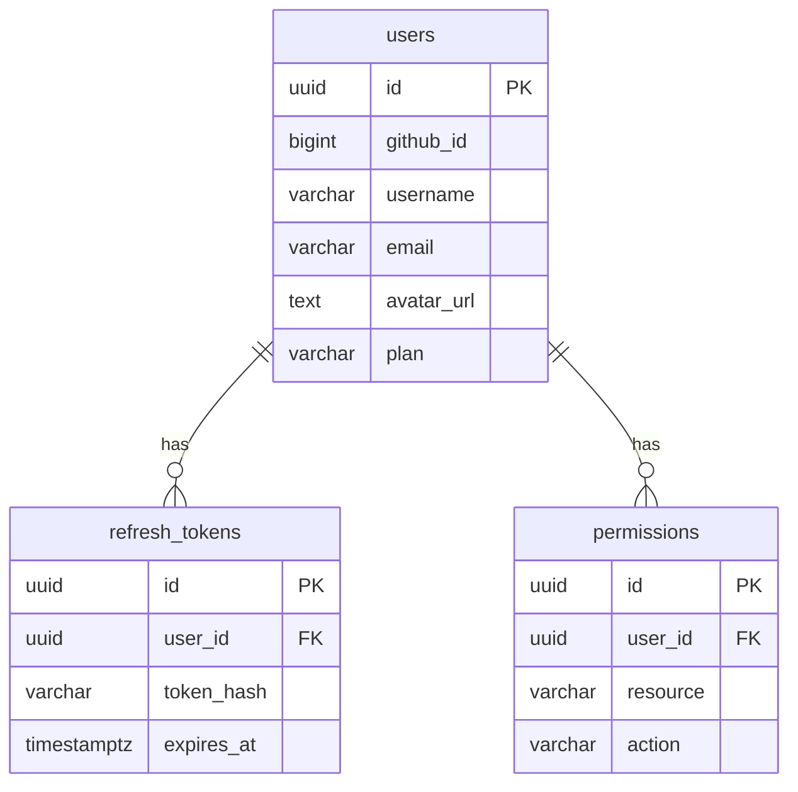
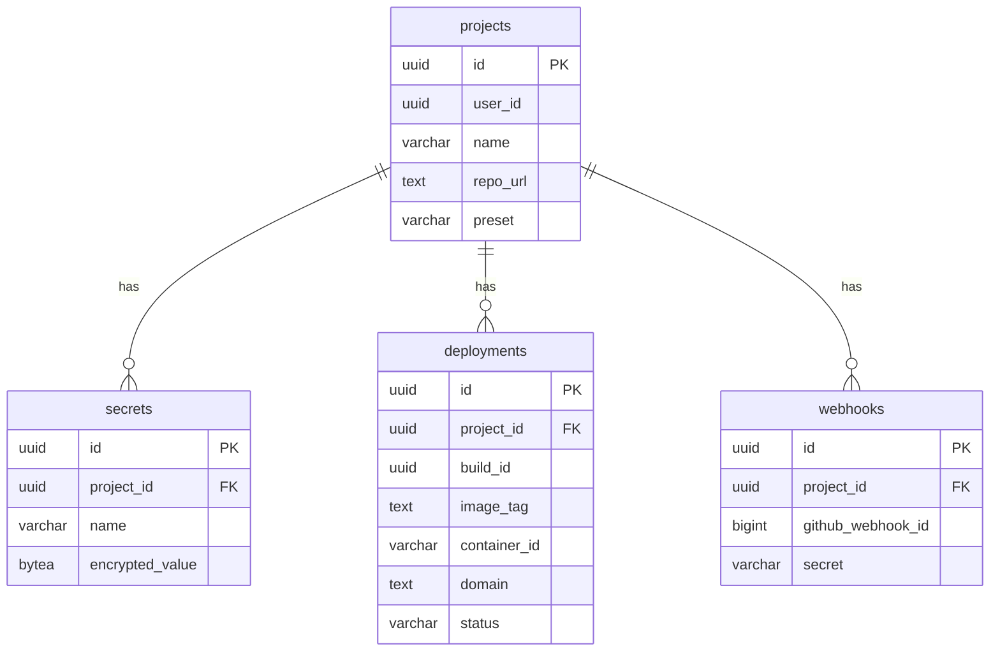
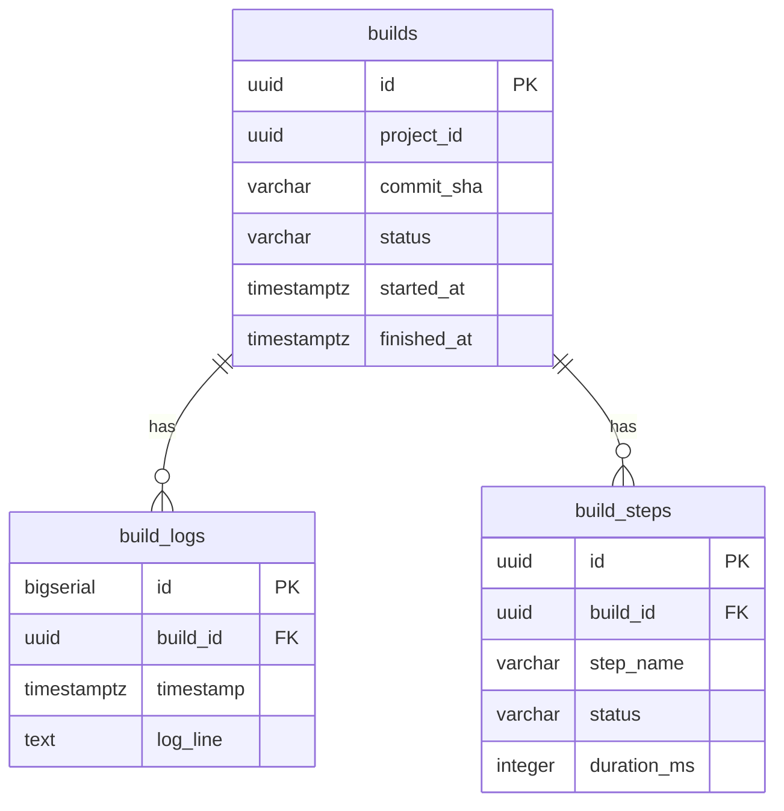
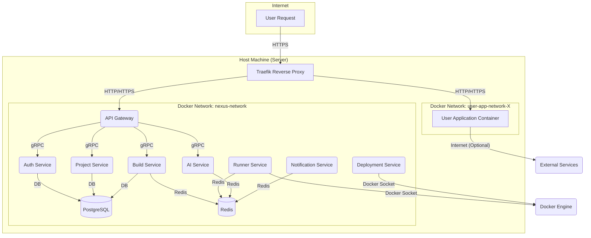

# Tài liệu SRS Môn thực tập tốt nghiệp - Nền tảng PaaS Mini tích hợp AI phân tích lỗi

**Phiên bản:** 1.0

---

**Thông tin chung:**

- **Tên đề tài:** NỀN TẢNG PAAS MINI TÍCH HỢP AI PHÂN TÍCH LỖI
- **Giảng viên hướng dẫn:** Thạc sĩ Nguyễn Văn Chiến
- **Sinh viên thực hiện:** Nguyễn Vương Minh Khôi
- **MSSV:** 22H1120108
- **Lớp:** CN22CLCD
- **GitHub:** [https://github.com/Khoi1909/NexusDeploy](https://github.com/Khoi1909/NexusDeploy)

---

## MỤC LỤC

- [CHƯƠNG 1. GIỚI THIỆU](#chương-1-giới-thiệu)
  - [1.1. Mục đích](#11-mục-đích)
  - [1.2. Phạm vi dự án](#12-phạm-vi-dự-án)
  - [1.3. Đối tượng dự kiến](#13-đối-tượng-dự-kiến)
  - [1.4. Định nghĩa, Thuật ngữ và Viết tắt](#14-định-nghĩa-thuật-ngữ-và-viết-tắt)
  - [1.5. Tổng quan tài liệu](#15-tổng-quan-tài-liệu)
- [CHƯƠNG 2. MÔ TẢ TỔNG QUAN](#chương-2-mô-tả-tổng-quan)
  - [2.1. Bối cảnh sản phẩm (Product Perspective)](#21-bối-cảnh-sản-phẩm-product-perspective)
  - [2.2. Tác nhân và Người dùng (Actors and Users)](#22-tác-nhân-và-người-dùng-actors-and-users)
  - [2.3. Sơ đồ Use Case tổng quan](#23-sơ-đồ-use-case-tổng-quan)
  - [2.4. Các giả định (Assumptions)](#24-các-giả-định-assumptions)
  - [2.5. Các ràng buộc (Constraints)](#25-các-ràng-buộc-constraints)
- [CHƯƠNG 3. YÊU CẦU CHỨC NĂNG (FUNCTIONAL REQUIREMENTS)](#chương-3-yêu-cầu-chức-năng-functional-requirements)
  - [3.1. FR1: Quản lý Xác thực (Authentication)](#31-fr1-quản-lý-xác-thực-authentication)
  - [3.2. FR2: Quản lý Dự án (Project Management)](#32-fr2-quản-lý-dự-án-project-management)
  - [3.3. FR3: Quản lý Biến môi trường (Secrets)](#33-fr3-quản-lý-biến-môi-trường-secrets)
  - [3.4. FR4: Quy trình Tích hợp & Triển khai (CI/CD Pipeline)](#34-fr4-quy-trình-tích-hợp--triển-khai-cicd-pipeline)
  - [3.5. FR5: Phân tích Lỗi bằng AI](#35-fr5-phân-tích-lỗi-bằng-ai)
  - [3.6. FR6: Hosting & Quản lý Vòng đời](#36-fr6-hosting--quản-lý-vòng-đời)
  - [3.7. FR7: Quản lý Gói đăng ký & Phân quyền (Plan & Permission)](#37-fr7-quản-lý-gói-đăng-ký--phân-quyền-plan--permission)
- [CHƯƠNG 4. YÊU CẦU PHI CHỨC NĂNG (NON-FUNCTIONAL REQUIREMENTS)](#chương-4-yêu-cầu-phi-chức-năng-non-functional-requirements)
  - [4.1. NFR1: Yêu cầu về Hiệu năng (Performance)](#41-nfr1-yêu-cầu-về-hiệu-năng-performance)
  - [4.2. NFR2: Yêu cầu về Bảo mật (Security)](#42-nfr2-yêu-cầu-về-bảo-mật-security)
  - [4.3. NFR3: Yêu cầu về Tính Sẵn sàng & Độ tin cậy (Availability & Reliability)](#43-nfr3-yêu-cầu-về-tính-sẵn-sàng--độ-tin-cậy-availability--reliability)
  - [4.4. NFR4: Yêu cầu về Tính Dễ sử dụng (Usability)](#44-nfr4-yêu-cầu-về-tính-dễ-sử-dụng-usability)
  - [4.5. NFR5: Yêu cầu về Giới hạn Tài nguyên (Resource Constraints)](#45-nfr5-yêu-cầu-về-giới-hạn-tài-nguyên-resource-constraints)

---

## CHƯƠNG 1. GIỚI THIỆU

### 1.1. Mục đích
Tài liệu này (SRS) đặc tả các yêu cầu về chức năng và phi chức năng cho dự án Nexus Deploy. Mục đích của tài liệu là cung cấp một mô tả chi tiết, rõ ràng và nhất quán về sản phẩm phần mềm sẽ được xây dựng.
Tài liệu này sẽ là cơ sở để:
- Định hướng quá trình thiết kế, lập trình và kiểm thử.
- Làm tài liệu tham chiếu và đánh giá cho giáo viên hướng dẫn.
- Thiết lập sự hiểu biết chung về các yêu cầu của dự án giữa các bên liên quan.

### 1.2. Phạm vi dự án
Nexus Deploy là một nền tảng Nền tảng như một Dịch vụ (PaaS - Platform-as-a-Service) hoàn chỉnh, được thiết kế để đơn giản hóa tối đa quy trình triển khai ứng dụng web cho lập trình viên.
Phạm vi của dự án bao gồm các chức năng chính sau:
1.  **Tích hợp GitHub:** Người dùng đăng nhập vào hệ thống bằng tài khoản GitHub (thông qua OAuth) và chọn các kho mã nguồn (repository) của họ để triển khai.
2.  **Tích hợp liên tục (CI):** Khi người dùng git push lên kho mã nguồn đã chọn, hệ thống sẽ tự động kích hoạt một quy trình (pipeline) build và test trong một môi trường Docker cô lập.
3.  **Hỗ trợ AI Phân tích Lỗi:** Nếu quy trình CI thất bại (build hoặc test lỗi), hệ thống sẽ cung cấp tính năng "Tell me why". Khi được kích hoạt, một Mô hình Ngôn ngữ Lớn (LLM) sẽ phân tích log lỗi và đưa ra gợi ý khắc phục.
4.  **Triển khai liên tục (CD) & Hosting:** Nếu quy trình CI thành công, hệ thống sẽ tự động build mã nguồn thành một Docker image, lưu trữ image và triển khai (host) ứng dụng dưới dạng một container.
5.  **Cung cấp Tên miền tự động:** Mỗi ứng dụng được triển khai thành công sẽ được tự động gán một tên miền con công khai (ví dụ: my-app.khqi.io.vn) với chứng chỉ SSL (HTTPS) hợp lệ.

Dự án này **không** bao gồm việc cung cấp dịch vụ cơ sở dữ liệu (Database-as-a-Service). Người dùng được yêu cầu kết nối đến các dịch vụ CSDL bên ngoài.

### 1.3. Đối tượng dự kiến
Tài liệu này dành cho các đối tượng sau:
- **Giáo viên hướng dẫn:** Để theo dõi, đánh giá và góp ý về phạm vi và tiến độ của đồ án.
- **Người phát triển (Developer):** Là người trực tiếp xây dựng dự án, dùng tài liệu này làm kim chỉ nam kỹ thuật.
- **Người kiểm thử (Tester):** Để thiết kế các kịch bản kiểm thử (test cases) dựa trên các yêu cầu chức năng.

### 1.4. Định nghĩa, Thuật ngữ và Viết tắt
- **PaaS (Platform-as-a-Service):** Nền tảng như một Dịch vụ.
- **CI (Continuous Integration):** Tích hợp liên tục.
- **CD (Continuous Deployment):** Triển khai liên tục.
- **SRS (Software Requirements Specification):** Đặc tả Yêu cầu Phần mềm.
- **LLM (Large Language Model):** Mô hình Ngôn ngữ Lớn (ví dụ: OpenAI, Anthropic).
- **OAuth (Open Authorization):** Giao thức ủy quyền mở, dùng để đăng nhập bằng GitHub.
- **gRPC:** Framework RPC hiệu năng cao do Google phát triển, dùng để giao tiếp giữa các microservice.
- **Runner Service:** Một microservice trong hệ thống, có nhiệm vụ thực thi các tác vụ CI/CD (build, test).
- **Traefik:** Một Reverse Proxy (Proxy ngược) hiện đại, dùng để tự động định tuyến tên miền và quản lý SSL.
- **Preset:** Một cấu hình định sẵn (ví dụ: Node.js, Go) mà người dùng chọn để hệ thống biết cách build và chạy dự án.
- **Secret:** Các biến môi trường bí mật (API keys, tokens) được mã hóa và lưu trữ.
- **GORM:** ORM (Object-Relational Mapping) cho Go, giúp tương tác với cơ sở dữ liệu.
- **Asynq:** Thư viện quản lý hàng đợi (job queue) cho Go, xây dựng trên Redis.
- **go-git:** Thư viện Go để đọc và thao tác với kho git.
- **Vite:** Công cụ build frontend hiện đại, tối ưu cho tốc độ phát triển.
- **TailwindCSS:** Framework CSS ưu tiên tiện ích (utility-first) để xây dựng giao diện nhanh chóng.

### 1.5. Tổng quan tài liệu
Tài liệu này được tổ chức thành các chương:
- **Chương 1 (Giới thiệu):** Cung cấp cái nhìn tổng quan, phạm vi, định nghĩa và mục đích của dự án.
- **Chương 2 (Mô tả tổng quan):** Mô tả các tác nhân (actors) liên quan, các giả định, ràng buộc, và kiến trúc hệ thống cấp cao.
- **Chương 3 (Yêu cầu chức năng):** Đặc tả chi tiết các tính năng mà hệ thống phải thực hiện.
- **Chương 4 (Yêu cầu phi chức năng):** Đặc tả các yêu cầu về hiệu năng, bảo mật, độ tin cậy và các ràng buộc kỹ thuật khác.

---

## CHƯƠNG 2. MÔ TẢ TỔNG QUAN

### 2.1. Bối cảnh sản phẩm (Product Perspective)
Nexus Deploy là một hệ thống web độc lập, hoạt động như một nền tảng PaaS hoàn chỉnh. Nó được thiết kế để tự động hóa toàn bộ quy trình từ mã nguồn (git push) đến một ứng dụng web đang chạy (HTTPS URL).
Hệ thống sẽ tương tác và phụ thuộc vào các thành phần bên ngoài sau:
- **GitHub:** Dùng làm nhà cung cấp xác thực (OAuth) và nguồn mã nguồn. Nexus Deploy sử dụng API của GitHub để liệt kê kho (repo) và tự động cài đặt Webhook.
- **Traefik:** Đóng vai trò là Reverse Proxy (Proxy ngược) ở tầng biên, chịu trách nhiệm định tuyến các tên miền con (subdomain) đến đúng container ứng dụng và tự động quản lý chứng chỉ SSL.
- **Docker Engine:** Môi trường thực thi lỗi. Nexus Deploy sử dụng Docker SDK for Go để tạo, quản lý và hủy các container một cách cô lập cho cả quá trình CI (build/test) và CD (host).
- **LLM API (External):** Một dịch vụ Mô hình Ngôn ngữ Lớn bên ngoài (như Gemini hoặc GPT) được gọi để thực hiện chức năng phân tích log lỗi.

### 2.2. Tác nhân và Người dùng (Actors and Users)
Hệ thống có hai tác nhân chính:

| Tác nhân | Mô tả |
| :--- | :--- |
| **Developer (Lập trình viên)** | Là người dùng cuối của Nexus Deploy. Họ muốn triển khai ứng dụng của mình một cách nhanh chóng. |
| **GitHub (Hệ thống)** | Là hệ thống bên ngoài, có nhiệm vụ thông báo cho Nexus Deploy mỗi khi có sự kiện git push mới. |

### 2.3. Sơ đồ Use Case tổng quan
Sơ đồ này mô tả các tương tác cấp cao của tác nhân "Developer" với hệ thống Nexus Deploy.
*(Nội dung hình ảnh về Use Case sẽ được cập nhật sau)*

### 2.4. Các giả định (Assumptions)
1.  **Hạ tầng:** Hệ thống được giả định chạy trên một máy chủ (Server) đã được cài đặt sẵn Docker, Docker SDK (cho Go), và Traefik.
2.  **DNS:** Tên miền chính (ví dụ: khqi.io.vn) và bản ghi Wildcard (*.khqi.io.vn) đã được trỏ chính xác đến IP của máy chủ.
3.  **Kiến thức Người dùng:** Người dùng (Developer) có kiến thức cơ bản về Git và hiểu cách tổ chức một dự án web (ví dụ: biết các lệnh build/start).
4.  **Phạm vi Ứng dụng:** Các dự án được triển khai là ứng dụng web dựa trên giao thức HTTP/HTTPS.
5.  **Tài khoản:** Người dùng bắt buộc phải có tài khoản GitHub.

### 2.5. Các ràng buộc (Constraints)
1.  **Công nghệ (Tech Stack):**
    - **Backend (Go Microservices):**
        - Ngôn ngữ: Go 1.21+
        - Kiến trúc: Microservices (8 services)
        - Giao tiếp: gRPC (nội bộ), REST API (bên ngoài), WebSocket (real-time)
        - ORM: GORM
        - Hàng đợi (Queue): Redis + Asynq
        - Tương tác Git: go-git
    - **Frontend:**
        - Framework: React 18 (sử dụng Vite)
        - Styling: TailwindCSS
        - Quản lý State: Zustand/Redux
    - **Cơ sở hạ tầng:**
        - CSDL: PostgreSQL 15+
        - Cache/Queue: Redis 7+
        - Reverse Proxy: Traefik 2.x
2.  **Hạ tầng (Infrastructure):**
    - Toàn bộ hệ thống (CI/CD, Hosting) phải chạy trên nền tảng Docker.
    - Hệ thống bắt buộc phụ thuộc vào Traefik để xử lý định tuyến và SSL.
3.  **Bảo mật (Security):**
    - Tất cả các "Secrets" (biến môi trường bí mật) của người dùng phải được mã hóa (ví dụ: AES-256) trước khi lưu vào cơ sở dữ liệu.
    - Các container của người dùng phải được chạy trong một mạng Docker riêng (isolated network) và không có đặc quyền (non-privileged) để đảm bảo an toàn.
4.  **Tài nguyên (Resources):**
    - Hệ thống phải có khả năng giới hạn tài nguyên (RAM, CPU) cho mỗi container ứng dụng của người dùng (dựa trên Gói đăng ký - Plan).
5.  **API Bên ngoài (External APIs):**
    - Hệ thống phụ thuộc vào tính khả dụng của GitHub API (cho OAuth, Webhook) và LLM API (cho phân tích lỗi). Nếu các API này gặp sự cố, các tính năng liên quan sẽ bị gián đoạn.
6.  **Service Discovery & Observability:**
    - **Service Discovery:** Các service nội bộ sẽ tìm thấy nhau thông qua Docker Compose DNS resolution (ví dụ: `http://auth-service:8001`).
    - **Health Checks:** Mỗi service phải cung cấp ít nhất 2 endpoint: `/health` (liveness probe) và `/ready` (readiness probe).
    - **Metrics:** Mỗi service nên cung cấp endpoint `/metrics` theo format của Prometheus để phục vụ cho việc giám sát.

### 2.6. System Architecture Diagram

Sơ đồ dưới đây cung cấp cái nhìn tổng quan về kiến trúc của hệ thống NexusDeploy.



---

## CHƯƠNG 3. YÊU CẦU CHỨC NĂNG (FUNCTIONAL REQUIREMENTS)

### 3.0. Service Boundaries Matrix

Phần này định nghĩa ranh giới và quyền hạn của từng service để đảm bảo tính chuyên biệt và giảm coupling.

| Service | CÓ QUYỀN (CAN) | KHÔNG CÓ QUYỀN (CANNOT) |
| :--- | :--- | :--- |
| **Auth Service** | - CRUD và quản lý `users`, `tokens` trong `auth_db`.<br>- Xử lý logic GitHub OAuth.<br>- Tạo, xác thực, và thu hồi JWT.<br>- Expose gRPC service cho các service khác. | - Truy cập `project_db` hoặc `build_db`.<br>- Gọi các service nội bộ khác.<br>- Biết về logic build, deployment, hay project. |
| **Project Service** | - CRUD và quản lý `projects`, `secrets`, `webhooks` trong `project_db`.<br>- Gọi GitHub API để quản lý repositories và webhooks.<br>- Mã hóa và giải mã secrets. | - Truy cập `auth_db` hoặc `build_db`.<br>- Gọi trực tiếp `Deployment Service` hoặc `Runner Service`.<br>- Thực thi build/test. |
| **Build Service** | - CRUD và quản lý `builds`, `build_logs` trong `build_db`.<br>- Điều phối (orchestrate) luồng CI/CD.<br>- Đẩy job vào Redis Queue.<br>- Gọi `Deployment Service` để kích hoạt deployment. | - Truy cập `auth_db` hoặc `project_db` trực tiếp.<br>- Thực thi các lệnh Docker.<br>- Tương tác trực tiếp với GitHub API. |
| **Runner Service** | - Lắng nghe job từ Redis Queue.<br>- Thực thi các lệnh Docker (build, test, push).<br>- Gọi `Project Service` để lấy config/secrets.<br>- Gọi `Build Service` để cập nhật trạng thái.<br>- Publish logs lên Redis Pub/Sub. | - Truy cập trực tiếp bất kỳ database nào.<br>- Có state riêng (phải là stateless worker).<br>- Điều phối luồng CI/CD. |
| **Deployment Svc** | - Thực thi các lệnh Docker (pull, run, stop, rm).<br>- Gán labels cho Traefik.<br>- Đọc "Deployment Spec" được truyền vào. | - Gọi `Project Service` hoặc `Auth Service` trực tiếp.<br>- Quyết định resource limits (phải nhận từ spec).<br>- Truy cập `build_db`. |
| **AI Service** | - Gọi `Build Service` để lấy logs.<br>- Gọi LLM API bên ngoài.<br>- Cache kết quả vào Redis. | - Truy cập bất kỳ database nào trực tiếp.<br>- Biết về cấu hình project chi tiết.<br>- Lưu trữ log dài hạn. |
| **Notification Svc**| - Quản lý WebSocket connections.<br>- Lắng nghe các kênh Redis Pub/Sub.<br>- Broadcast messages cho clients. | - Có state hoặc logic nghiệp vụ.<br>- Gọi các gRPC service khác.<br>- Truy cập bất kỳ database nào. |
| **API Gateway** | - Định tuyến HTTP requests.<br>- Xác thực JWT bằng cách gọi `Auth Service`.<br>- Rate limiting, CORS.<br>- Chuyển tiếp request đến các gRPC service. | - Chứa bất kỳ logic nghiệp vụ nào.<br>- Truy cập trực tiếp bất kỳ database nào.<br>- Lưu trữ state. |

### 3.1. FR1: Quản lý Xác thực (Authentication)

**Service chịu trách nhiệm chính:** `Auth Service`

| ID | Yêu cầu | Mô tả chi tiết |
| :--- | :--- | :--- |
| **FR1.1** | Đăng nhập bằng GitHub | - **Mô tả:** Giao diện Frontend điều hướng người dùng đến `API Gateway`, Gateway chuyển hướng đến `Auth Service` để bắt đầu luồng GitHub OAuth.<br>- **Chi tiết kỹ thuật:** `Auth Service` tạo và quản lý `state` parameter để chống CSRF. |
| **FR1.2** | Xử lý Callback | - **Mô tả:** `Auth Service` cung cấp endpoint `/auth/github/callback` để nhận `authorization_code` từ GitHub.<br>- **Chi tiết kỹ thuật:** Endpoint phải xác thực `state` parameter trước khi xử lý. |
| **FR1.3** | Tạo phiên (Session) | - **Mô tả:** `Auth Service` trao đổi `code` để lấy `access_token` từ GitHub, sau đó tạo một JWT nội bộ và trả về cho Frontend.<br>- **Chi tiết kỹ thuật:** JWT chứa `user_id`, `plan`, và `exp`. `access_token` của GitHub được mã hóa và lưu vào `auth_db`. |
| **FR1.4** | Đăng xuất | - **Mô tả:** `Auth Service` cung cấp endpoint để vô hiệu hóa JWT.<br>- **Chi tiết kỹ thuật:** Sử dụng cơ chế blacklist trên Redis với key là JTI (JWT ID) và giá trị là thời gian hết hạn của token. |
| **FR1.5** | Đồng bộ thông tin | - **Mô tả:** Lần đầu đăng nhập, `Auth Service` dùng `access_token` để lấy thông tin user từ GitHub và lưu vào bảng `users` trong `auth_db`.<br>- **Chi tiết kỹ thuật:** Chỉ đồng bộ các thông tin cơ bản: `github_id`, `username`, `email`, `avatar`. |

### 3.2. FR2: Quản lý Dự án (Project Management)

**Service chịu trách nhiệm chính:** `Project Service`

| ID | Yêu cầu | Mô tả chi tiết |
| :--- | :--- | :--- |
| **FR2.1** | Thêm Dự án mới | - **Mô tả:** `Project Service` cung cấp gRPC method `CreateProject` để tạo một dự án mới trong `project_db`.<br>- **Chi tiết kỹ thuật:** Method này nhận `user_id`, `repo_url`, `preset` và các cấu hình ban đầu. |
| **FR2.2** | Liệt kê Kho (Repo) | - **Mô tả:** `Project Service` gọi GitHub API bằng `access_token` của user để lấy danh sách repositories.<br>- **Chi tiết kỹ thuật:** `access_token` được truyền từ `API Gateway` sau khi xác thực. `Project Service` không lưu trữ token này. |
| **FR2.3** | Cài đặt Webhook | - **Mô tả:** Khi tạo dự án, `Project Service` gọi GitHub API để tự động thêm một webhook, trỏ đến endpoint của `API Gateway`.<br>- **Chi tiết kỹ thuật:** Secret của webhook được tạo và lưu vào `project_db`. |
| **FR2.4** | Cấu hình Preset | - **Mô tả:** `Project Service` lưu trữ và quản lý cấu hình `preset` (ví dụ: Node.js, Go) cho mỗi dự án.<br>- **Chi tiết kỹ thuật:** Cấu hình này bao gồm các lệnh build/start mặc định. |
| **FR2.5** | Cấu hình Lệnh (UI) | - **Mô tả:** `Project Service` cho phép cập nhật các lệnh build và start tùy chỉnh cho một dự án.<br>- **Chi tiết kỹ thuật:** Các lệnh này được lưu trong bảng `projects` của `project_db`. |
| **FR2.6** | Cấu hình Port (Nâng cao) | - **Mô tả:** `Project Service` cho phép người dùng ghi đè port nội bộ của ứng dụng.<br>- **Chi tiết kỹ thuật:** Port này sẽ được `Deployment Service` sử dụng khi triển khai. |
| **FR2.7** | Xóa Dự án | - **Mô tả:** `Project Service` điều phối việc xóa dự án, bao gồm gọi `Deployment Service` để dừng container và gọi GitHub API để gỡ webhook.<br>- **Chi-tiết kỹ thuật:** Đây là một saga transaction đơn giản để đảm bảo tính nhất quán. |

### 3.3. FR3: Quản lý Biến môi trường (Secrets)

**Service chịu trách nhiệm chính:** `Project Service`

| ID | Yêu cầu | Mô tả chi tiết |
| :--- | :--- | :--- |
| **FR3.1** | Giao diện CRUD | - **Mô tả:** `Project Service` cung cấp các gRPC method để quản lý secrets (Add, Update, Delete).<br>- **Chi tiết kỹ thuật:** API được expose cho Frontend thông qua `API Gateway`. |
| **FR3.2** | Mã hóa tại Backend | - **Mô tả:** `Project Service` sử dụng một master key của hệ thống để mã hóa giá trị của secret bằng thuật toán AES-256-GCM trước khi lưu vào `project_db`.<br>- **Chi tiết kỹ thuật:** Master key được inject vào `Project Service` qua biến môi trường hoặc một hệ thống quản lý secret. |
| **FR3.3** | Che giấu Giá trị | - **Mô tả:** API của `Project Service` không bao giờ trả về giá trị secret đã giải mã cho client bên ngoài.<br>- **Chi tiết kỹ thuật:** API chỉ trả về tên secret và một giá trị placeholder (ví dụ: `**********`). |
| **FR3.4** | Tiêm (Inject) vào CI | - **Mô tả:** `Runner Service` gọi gRPC method `GetSecrets` của `Project Service` để lấy các secret đã được giải mã.<br>- **Chi tiết kỹ thuật:** Cuộc gọi này phải được xác thực (ví dụ: mTLS) để đảm bảo chỉ `Runner Service` mới có quyền truy cập. |
| **FR3.5** | Tiêm (Inject) vào Host | - **Mô tả:** `Build Service` (với vai trò orchestrator) gọi `Project Service` để lấy secrets và truyền chúng vào "Deployment Spec" cho `Deployment Service`.<br>- **Chi tiết kỹ thuật:** `Deployment Service` không gọi trực tiếp `Project Service`, giảm coupling. |

### 3.4. FR4: Quy trình Tích hợp & Triển khai (CI/CD Pipeline)

**Service điều phối chính (Orchestrator):** `Build Service`

| ID | Yêu cầu | Mô tả chi tiết |
| :--- | :--- | :--- |
| **FR4.1** | Kích hoạt (Trigger) | - **Mô tả:** `API Gateway` nhận webhook từ GitHub, xác thực và chuyển tiếp đến `Build Service` để bắt đầu quy trình.<br>- **Service liên quan:** `API Gateway`, `Build Service`. |
| **FR4.2** | Tạo Tác vụ (Job) | - **Mô tả:** `Build Service` tạo một bản ghi build trong `build_db` và đẩy một job message chứa `build_id` vào Redis Queue.<br>- **Chi tiết kỹ thuật:** Job message là một JSON payload được định nghĩa rõ ràng. |
| **FR4.3** | Nhận Tác vụ (Runner) | - **Mô tả:** `Runner Service` lắng nghe queue, nhận job, và gọi `Build Service` để cập nhật trạng thái build thành "Running".<br>- **Service liên quan:** `Runner Service`, `Build Service`. |
| **FR4.4** | Giai đoạn CI (Build/Test) | - **Mô tả:** `Runner Service` thực thi các lệnh build/test trong một container Docker cô lập.<br>- **Chi tiết kỹ thuật:** `Runner` gọi `Project Service` để lấy cấu hình và secrets trước khi bắt đầu. |
| **FR4.5** | Truyền Log (Build) | - **Mô tả:** `Runner Service` publish log output lên một kênh Redis Pub/Sub.<br>- **Chi tiết kỹ thuật:** `Notification Service` lắng nghe kênh này để stream log đến client. |
| **FR4.6** | Xử lý CI Thất bại | - **Mô tả:** Nếu CI thất bại, `Runner Service` gọi `Build Service` để cập nhật trạng thái build thành "Failed" và gửi toàn bộ log.<br>- **Chi tiết kỹ thuật:** `Build Service` lưu log vào `build_db`. |
| **FR4.7** | Giai đoạn CD (Build Image) | - **Mô tả:** Nếu CI thành công, `Runner Service` build Docker image cho ứng dụng.<br>- **Service liên quan:** `Runner Service`. |
| **FR4.8** | Đẩy Image (Push) | - **Mô tả:** `Runner Service` đẩy image vừa build lên Docker Registry.<br>- **Service liên quan:** `Runner Service`. |
| **FR4.9** | Giai đoạn CD (Host) | - **Mô tả:** `Runner Service` báo cho `Build Service` rằng image đã sẵn sàng. `Build Service` sau đó tạo "Deployment Spec" và gọi `Deployment Service` để bắt đầu triển khai.<br>- **Chi tiết kỹ thuật:** `Build Service` đóng vai trò điều phối, quyết định khi nào bắt đầu deployment. |
| **FR4.10**| Hoàn tất Tác vụ | - **Mô tả:** `Deployment Service` báo cáo kết quả triển khai cho `Build Service`. `Build Service` cập nhật trạng thái cuối cùng của build là "Success" hoặc "DeployFailed".<br>- **Service liên quan:** `Deployment Service`, `Build Service`. |

#### 3.4.1. Build State Machine

Sơ đồ dưới đây mô tả các trạng thái và sự chuyển đổi của một build job, được quản lý bởi `Build Service`.



### 3.5. FR5: Phân tích Lỗi bằng AI

**Service chịu trách nhiệm chính:** `AI Service`

| ID | Yêu cầu | Mô tả chi tiết |
| :--- | :--- | :--- |
| **FR5.1** | Kích hoạt (UI) | - **Mô tả:** Giao diện Frontend hiển thị nút "Tell me why" cho các build có trạng thái "Failed".<br>- **Service liên quan:** (Frontend). |
| **FR5.2** | Gửi Yêu cầu AI | - **Mô tả:** Frontend gọi API của `API Gateway` để yêu cầu phân tích lỗi cho một `build_id`.<br>- **Service liên quan:** `API Gateway`. |
| **FR5.3** | Xử lý (Backend) | - **Mô tả:** `API Gateway` gọi `Auth Service` để kiểm tra quyền, sau đó chuyển tiếp yêu cầu đến `AI Service`. `AI Service` gọi `Build Service` để lấy log của `build_id` tương ứng.<br>- **Service liên quan:** `API Gateway`, `Auth Service`, `AI Service`, `Build Service`. |
| **FR5.4** | Gọi LLM API | - **Mô tả:** `AI Service` xây dựng một prompt chi tiết từ log lỗi và gọi API của LLM bên ngoài.<br>- **Chi tiết kỹ thuật:** Prompt engineering là một phần quan trọng của service này. |
| **FR5.5** | Phân cấp Gói (Standard) | - **Mô tả:** Dựa trên thông tin plan từ `Auth Service`, `AI Service` điều chỉnh prompt để LLM chỉ trả về gợi ý chung.<br>- **Service liên quan:** `AI Service`, `Auth Service`. |
| **FR5.6** | Phân cấp Gói (Premium) | - **Mô tả:** Với gói "Premium", `AI Service` sử dụng một prompt khác để yêu cầu LLM cung cấp đề xuất sửa lỗi chi tiết.<br>- **Service liên quan:** `AI Service`, `Auth Service`. |
| **FR5.7** | Hiển thị Kết quả | - **Mô tả:** `AI Service` xử lý và trả kết quả về cho `API Gateway` để hiển thị trên Frontend.<br>- **Chi tiết kỹ thuật:** `AI Service` nên có cơ chế cache kết quả trên Redis để giảm chi phí và độ trễ. |

### 3.6. FR6: Hosting & Quản lý Vòng đời

**Service chịu trách nhiệm chính:** `Deployment Service`

| ID | Yêu cầu | Mô tả chi tiết |
| :--- | :--- | :--- |
| **FR6.1** | Kích hoạt Triển khai | - **Mô tả:** `Deployment Service` nhận một "Deployment Spec" từ `Build Service` để bắt đầu quá trình triển khai.<br>- **Chi tiết kỹ thuật:** Spec chứa tất cả thông tin cần thiết: image, tag, secrets, resource limits. |
| **FR6.2** | Dọn dẹp Container cũ | - **Mô tả:** Trước khi triển khai phiên bản mới, `Deployment Service` sẽ dừng và xóa container cũ nếu có.<br>- **Chi tiết kỹ thuật:** Cần có cơ chế kiểm tra health check của container mới trước khi xóa container cũ để đảm bảo zero-downtime. |
| **FR6.3** | Chạy Container mới | - **Mô tả:** `Deployment Service` sử dụng Docker SDK để pull image và chạy container mới.<br>- **Service liên quan:** `Deployment Service`. |
| **FR6.4** | Tiêm Biến (Host) | - **Mô tả:** Tất cả biến môi trường và secrets được truyền vào container thông qua "Deployment Spec".<br>- **Chi tiết kỹ thuật:** `Deployment Service` không cần gọi các service khác, giảm coupling. |
| **FR6.5** | Gán Nhãn (Labels) | - **Mô tả:** `Deployment Service` gán các labels của Traefik vào container để cấu hình routing và SSL tự động.<br>- **Service liên quan:** `Deployment Service`. |
| **FR6.6** | Giới hạn Tài nguyên | - **Mô tả:** Các giới hạn về RAM/CPU được định nghĩa trong "Deployment Spec" và được `Deployment Service` áp dụng khi chạy container.<br>- **Service liên quan:** `Deployment Service`. |
| **FR6.7** | Xem Log (Runtime) | - **Mô tả:** `Deployment Service` thu thập log từ container và publish lên Redis Pub/Sub.<br>- **Chi tiết kỹ thuật:** `Notification Service` lắng nghe kênh này để stream log đến client, thống nhất với cơ chế build log. |
| **FR6.8** | Khởi động lại (Restart) | - **Mô tả:** `Deployment Service` cung cấp API để restart một container.<br>- **Service liên quan:** `Deployment Service`. |
| **FR6.9** | Dừng (Stop) | - **Mô tả:** `Deployment Service` cung cấp API để dừng và xóa một container đang chạy.<br>- **Service liên quan:** `Deployment Service`. |

### 3.7. FR7: Quản lý Gói đăng ký & Phân quyền (Plan & Permission)

**Service chịu trách nhiệm chính:** `Auth Service`

| ID | Yêu cầu | Mô tả chi tiết |
| :--- | :--- | :--- |
| **FR7.1** | Định nghĩa Gói | - **Mô tả:** `Auth Service` là nơi định nghĩa các cấp độ gói và các giới hạn tương ứng (số dự án, build đồng thời, RAM, CPU).<br>- **Chi tiết kỹ thuật:** Thông tin này có thể được lưu trong `auth_db` hoặc file config của `Auth Service`. |
| **FR7.2** | Gói Mặc định | - **Mô tả:** Khi user mới đăng ký, `Auth Service` tự động gán cho họ gói "Standard".<br>- **Service liên quan:** `Auth Service`. |
| **FR7.3** | Bảng Phân quyền | - **Mô tả:** `Auth Service` cung cấp gRPC method `GetUserPlan` để các service khác có thể truy vấn thông tin gói và quyền của user.<br>- **Service liên quan:** `Auth Service`. |
| **FR7.4** | Thực thi Phân quyền | - **Mô tả:** Các service có trách nhiệm gọi `Auth Service` để kiểm tra quyền trước khi thực hiện hành động.<br>- **Chi tiết thực thi:**<br>  - **Tạo dự án:** `Project Service`, trước khi tạo, sẽ gọi `AuthService.CheckPermission(user_id, "project", "create")` để kiểm tra giới hạn số dự án.<br>  - **Trigger build:** `Build Service` sẽ gọi `AuthService.CheckPermission(user_id, "build", "create")` để kiểm tra giới hạn build đồng thời.<br>  - **Deploy container:** `Deployment Service` sẽ nhận resource limits (RAM, CPU) trong "Deployment Spec" từ `Build Service`, `Build Service` đã lấy thông tin này từ `Auth Service`.<br>  - **Phân tích AI:** `AI Service` sẽ gọi `AuthService.GetUserPlan(user_id)` để quyết định mức độ phân tích. |
| **FR7.5** | Giao diện Nâng cấp | - **Mô tả:** Frontend hiển thị trang mô tả các gói. Luồng nâng cấp thực tế (tích hợp thanh toán) nằm ngoài phạm vi dự án.<br>- **Service liên quan:** (Frontend). |
| **FR7.6** | Luồng Upgrade/Downgrade | - **Mô tả:** Việc thay đổi gói của người dùng được thực hiện thủ công (ví dụ: qua admin tool). Khi được kích hoạt, `Auth Service` sẽ cập nhật trường `plan` trong bảng `users` của `auth_db`.<br>- **Chi tiết kỹ thuật:** Ngay sau khi `plan` được cập nhật, các giới hạn mới sẽ được áp dụng cho các hành động tiếp theo của người dùng. `Deployment Service` có thể cần được thông báo để điều chỉnh tài nguyên cho các ứng dụng đang chạy. |

### 3.8. Error Handling & Fault Tolerance

Bảng này định nghĩa cách hệ thống xử lý các kịch bản lỗi quan trọng giữa các service.

| Service Call | Kịch bản lỗi (Error Case) | Hành động (Action) | Chính sách Retry | Thông báo cho User (English) |
| :--- | :--- | :--- | :--- | :--- |
| Resource exhaustion: Disk full, memory full, CPU throttle | Các service sẽ cố gắng giải phóng tài nguyên (nếu có thể) hoặc chuyển sang trạng thái unhealthy. Các request mới sẽ bị từ chối. | Không retry tự động (cần can thiệp thủ công) | "Hệ thống đang quá tải. Vui lòng thử lại sau." |
| Service crashes: Mid-build, mid-deployment | Build Service sẽ đánh dấu build là "Failed". Deployment Service sẽ cố gắng rollback hoặc giữ trạng thái hiện tại. | Không retry tự động (cần can thiệp thủ công) | "Build/Deployment thất bại do lỗi hệ thống. Vui lòng liên hệ hỗ trợ." |
| Runner → Project.GetSecrets | Project Service không thể truy cập | Đánh dấu build "Failed" | 3 lần, exponential backoff | "Build failed: A system configuration error occurred." |
| Build → Deployment.Deploy | Deployment Service không phản hồi | Giữ build ở trạng thái "Deploying" | Không tự động retry | "Deployment is queued and will start shortly..." |
| Bất kỳ service nào → GitHub API | API bị rate limit | Tạm dừng hành động, chờ | Retry sau 1 phút | "GitHub API is busy. Please try again in a few moments." |
| Runner → Docker Registry | Lỗi Docker Registry: Network, auth, capacity | Runner Service sẽ retry 3 lần với exponential backoff. Nếu vẫn thất bại, build sẽ bị đánh dấu "Failed". | 3 lần, exponential backoff | "Build failed: Không thể truy cập Docker Registry. Vui lòng thử lại sau." |
| Bất kỳ service nào → Database | Mất kết nối CSDL | Service chuyển sang trạng thái unhealthy, từ chối request mới | Retry kết nối ở background | (No direct notification) System returns a 5xx error. |
| Deployment Service | Container mới crash sau khi start | Rollback về container cũ (nếu có) | Không retry | "Deployment failed. Rolling back to the previous version." |

### 3.9. Sample API Contracts

Phần này cung cấp các ví dụ về định nghĩa API contract sử dụng cú pháp Protocol Buffers (Protobuf) cho các gRPC method quan trọng.

**1. Auth.ValidateToken**

```protobuf
// auth.proto
service AuthService {
  rpc ValidateToken(ValidateTokenRequest) returns (ValidateTokenResponse);
}

message ValidateTokenRequest {
  string jwt = 1;
}

message ValidateTokenResponse {
  string user_id = 1;
  string plan = 2;
  bool is_valid = 3;
}
```

**2. Project.GetSecrets**

```protobuf
// project.proto
service ProjectService {
  rpc GetSecrets(GetSecretsRequest) returns (GetSecretsResponse);
}

message GetSecretsRequest {
  string project_id = 1;
}

message GetSecretsResponse {
  map<string, string> secrets = 1;
}
```

**3. Build.UpdateBuildStatus**

```protobuf
// build.proto
service BuildService {
  rpc UpdateBuildStatus(UpdateBuildStatusRequest) returns (UpdateBuildStatusResponse);
}

message UpdateBuildStatusRequest {
  string build_id = 1;
  string status = 2; // e.g., "RUNNING", "FAILED", "SUCCESS"
  repeated string log_lines = 3; // Chỉ gửi log khi build fail
}

message UpdateBuildStatusResponse {
  bool acknowledged = 1;
}
```

---

## PHỤ LỤC B: THIẾT KẾ SCHEMA CƠ SỞ DỮ LIỆU

Phần này đặc tả chi tiết cấu trúc của 3 database được sử dụng trong hệ thống.

### B.1. Auth DB (`auth_db`)

**Mục đích:** Lưu trữ thông tin người dùng, xác thực, và phân quyền.

**Bảng: `users`**
| Tên cột | Kiểu dữ liệu | Ràng buộc | Mô tả |
| :--- | :--- | :--- | :--- |
| `id` | `uuid` | `PRIMARY KEY, DEFAULT gen_random_uuid()` | Khóa chính, định danh duy nhất cho user. |
| `github_id` | `bigint` | `UNIQUE, NOT NULL` | ID người dùng từ GitHub. |
| `username` | `varchar(255)` | `NOT NULL` | Tên người dùng GitHub. |
| `email` | `varchar(255)` | `UNIQUE, NOT NULL` | Email chính của người dùng. |
| `avatar_url` | `text` | | URL ảnh đại diện của người dùng. |
| `plan` | `varchar(50)` | `NOT NULL, DEFAULT 'standard'` | Gói đăng ký của người dùng ('standard', 'premium'). |
| `created_at` | `timestamptz` | `NOT NULL, DEFAULT now()` | Thời gian tạo tài khoản. |
| `updated_at` | `timestamptz` | `NOT NULL, DEFAULT now()` | Thời gian cập nhật tài khoản lần cuối. |

**Bảng: `refresh_tokens`**
| Tên cột | Kiểu dữ liệu | Ràng buộc | Mô tả |
| :--- | :--- | :--- | :--- |
| `id` | `uuid` | `PRIMARY KEY, DEFAULT gen_random_uuid()` | Khóa chính. |
| `user_id` | `uuid` | `FOREIGN KEY (users.id) ON DELETE CASCADE` | Liên kết đến người dùng sở hữu token. |
| `token_hash` | `varchar(255)` | `UNIQUE, NOT NULL` | Hash của refresh token để chống lộ lọt. |
| `expires_at` | `timestamptz` | `NOT NULL` | Thời gian hết hạn của token. |

**Bảng: `permissions`**
| Tên cột | Kiểu dữ liệu | Ràng buộc | Mô tả |
| :--- | :--- | :--- | :--- |
| `id` | `uuid` | `PRIMARY KEY, DEFAULT gen_random_uuid()` | Khóa chính. |
| `user_id` | `uuid` | `NOT NULL, FOREIGN KEY (users.id) ON DELETE CASCADE` | Người dùng được cấp quyền. |
| `resource` | `varchar(100)` | `NOT NULL` | Tài nguyên được cấp quyền (ví dụ: 'project', 'billing'). |
| `action` | `varchar(50)` | `NOT NULL` | Hành động được phép (ví dụ: 'create', 'delete'). |

### B.2. Project DB (`project_db`)

**Mục đích:** Lưu trữ thông tin về các dự án, cấu hình, và deployments.

**Bảng: `projects`**
| Tên cột | Kiểu dữ liệu | Ràng buộc | Mô tả |
| :--- | :--- | :--- | :--- |
| `id` | `uuid` | `PRIMARY KEY, DEFAULT gen_random_uuid()` | Khóa chính, định danh duy nhất cho dự án. |
| `user_id` | `uuid` | `NOT NULL` | ID của người dùng sở hữu dự án. |
| `name` | `varchar(255)` | `NOT NULL` | Tên dự án (ví dụ: 'my-awesome-app'). |
| `repo_url` | `text` | `NOT NULL` | URL của kho mã nguồn GitHub. |
| `branch` | `varchar(255)` | `NOT NULL, DEFAULT 'main'` | Nhánh mặc định để build. |
| `preset` | `varchar(50)` | `NOT NULL` | Preset được chọn (ví dụ: 'nodejs', 'go'). |
| `build_command`| `text` | | Lệnh để build dự án. |
| `start_command`| `text` | | Lệnh để khởi chạy ứng dụng. |
| `port` | `integer` | `NOT NULL, DEFAULT 8080` | Port nội bộ mà ứng dụng lắng nghe. |
| `created_at` | `timestamptz` | `NOT NULL, DEFAULT now()` | Thời gian tạo dự án. |
| `updated_at` | `timestamptz` | `NOT NULL, DEFAULT now()` | Thời gian cập nhật dự án lần cuối. |

**Bảng: `secrets`**
| Tên cột | Kiểu dữ liệu | Ràng buộc | Mô tả |
| :--- | :--- | :--- | :--- |
| `id` | `uuid` | `PRIMARY KEY, DEFAULT gen_random_uuid()` | Khóa chính. |
| `project_id` | `uuid` | `FOREIGN KEY (projects.id) ON DELETE CASCADE` | Liên kết đến dự án sở hữu secret. |
| `name` | `varchar(255)` | `NOT NULL` | Tên của biến môi trường. |
| `encrypted_value` | `bytea` | `NOT NULL` | Giá trị đã được mã hóa bằng AES-256-GCM. |

**Bảng: `deployments`**
| Tên cột | Kiểu dữ liệu | Ràng buộc | Mô tả |
| :--- | :--- | :--- | :--- |
| `id` | `uuid` | `PRIMARY KEY, DEFAULT gen_random_uuid()` | Khóa chính. |
| `project_id` | `uuid` | `FOREIGN KEY (projects.id) ON DELETE CASCADE` | Liên kết đến dự án. |
| `build_id` | `uuid` | `NOT NULL` | ID của build tương ứng tạo ra deployment này. |
| `image_tag` | `text` | `NOT NULL` | Tag của Docker image đã được build. |
| `container_id` | `varchar(255)`| | ID của container đang chạy. |
| `domain` | `text` | | Tên miền được gán cho deployment. |
| `status` | `varchar(50)` | `NOT NULL` | Trạng thái ('active', 'stopped', 'failed'). |
| `created_at` | `timestamptz` | `NOT NULL, DEFAULT now()` | Thời gian deployment được tạo. |

**Bảng: `webhooks`**
| Tên cột | Kiểu dữ liệu | Ràng buộc | Mô tả |
| :--- | :--- | :--- | :--- |
| `id` | `uuid` | `PRIMARY KEY, DEFAULT gen_random_uuid()` | Khóa chính. |
| `project_id` | `uuid` | `NOT NULL, FOREIGN KEY (projects.id) ON DELETE CASCADE` | Dự án mà webhook này thuộc về. |
| `github_webhook_id` | `bigint` | `NOT NULL` | ID của webhook trên hệ thống GitHub. |
| `secret` | `varchar(255)` | `NOT NULL` | Secret dùng để xác thực payload từ GitHub. |

### B.3. Build DB (`build_db`)

**Mục đích:** Lưu trữ lịch sử và log của các quá trình build.

**Bảng: `builds`**
| Tên cột | Kiểu dữ liệu | Ràng buộc | Mô tả |
| :--- | :--- | :--- | :--- |
| `id` | `uuid` | `PRIMARY KEY, DEFAULT gen_random_uuid()` | Khóa chính, định danh duy nhất cho một lần build. |
| `project_id` | `uuid` | `NOT NULL` | ID của dự án được build. |
| `commit_sha` | `varchar(40)` | | SHA của commit được build. |
| `status` | `varchar(50)` | `NOT NULL` | Trạng thái ('pending', 'running', 'success', 'failed', 'deploy_failed'). |
| `started_at` | `timestamptz` | | Thời gian bắt đầu build. |
| `finished_at` | `timestamptz` | | Thời gian kết thúc build. |

**Bảng: `build_logs`**
| Tên cột | Kiểu dữ liệu | Ràng buộc | Mô tả |
| :--- | :--- | :--- | :--- |
| `id` | `bigserial` | `PRIMARY KEY` | Khóa chính tự tăng. |
| `build_id` | `uuid` | `FOREIGN KEY (builds.id) ON DELETE CASCADE` | Liên kết đến lần build sở hữu log. |
| `timestamp` | `timestamptz` | `NOT NULL` | Thời gian của dòng log. |
| `log_line` | `text` | `NOT NULL` | Nội dung của dòng log. |

**Bảng: `build_steps`**
| Tên cột | Kiểu dữ liệu | Ràng buộc | Mô tả |
| :--- | :--- | :--- | :--- |
| `id` | `uuid` | `PRIMARY KEY, DEFAULT gen_random_uuid()` | Khóa chính. |
| `build_id` | `uuid` | `NOT NULL, FOREIGN KEY (builds.id) ON DELETE CASCADE` | Liên kết đến lần build. |
| `step_name` | `varchar(100)` | `NOT NULL` | Tên của bước build (ví dụ: 'clone', 'build', 'test'). |
| `status` | `varchar(50)` | `NOT NULL` | Trạng thái của bước build. |
| `duration_ms` | `integer` | | Thời gian hoàn thành bước (ms). |

## PHỤ LỤC C: ĐẶC TẢ API VÀ EVENTS

### C.1. REST API Endpoints (API Gateway)

Bảng này liệt kê các REST API chính mà API Gateway cung cấp cho Frontend.

| Method | Path | Service được gọi (gRPC) | Mô tả |
| :--- | :--- | :--- | :--- |
| `GET` | `/auth/github/login` | `AuthService` | Bắt đầu luồng đăng nhập GitHub OAuth. |
| `GET` | `/auth/github/callback` | `AuthService` | Xử lý callback từ GitHub. |
| `POST`| `/auth/logout` | `AuthService` | Đăng xuất và vô hiệu hóa token. |
| `GET` | `/projects` | `ProjectService` | Lấy danh sách dự án của user. |
| `POST`| `/projects` | `ProjectService` | Tạo một dự án mới. |
| `GET` | `/projects/{id}` | `ProjectService` | Lấy chi tiết một dự án. |
| `GET` | `/projects/{id}/builds` | `BuildService` | Lấy lịch sử build của một dự án. |
| `POST`| `/builds/{id}/analyze` | `AIService` | Yêu cầu phân tích lỗi cho một build. |
| `GET` | `/ws/notifications` | `NotificationService` | Nâng cấp kết nối lên WebSocket. |

**Ví dụ về Request/Response Bodies:**

**1. `POST /projects`**
- **Mô tả:** Tạo một dự án mới.
- **Request Body:**
  ```json
  {
    "name": "my-new-app",
    "repo_url": "https://github.com/user/my-new-app.git",
    "preset": "nodejs",
    "branch": "develop"
  }
  ```
- **Response Body (201 Created):**
  ```json
  {
    "id": "a1b2c3d4-e5f6-7890-1234-567890abcdef",
    "name": "my-new-app",
    "status": "pending_initial_build"
  }
  ```

**2. `POST /auth/logout`**
- **Mô tả:** Đăng xuất người dùng.
- **Request Body:** (empty)
- **Response Body (200 OK):**
  ```json
  {
    "message": "Logged out successfully"
  }
  ```

**3. `POST /builds/{id}/analyze`**
- **Mô tả:** Yêu cầu phân tích AI cho một build đã thất bại.
- **Request Body:** (empty)
- **Response Body (202 Accepted):**
  ```json
  {
    "message": "AI analysis has been queued.",
    "analysis_id": "f0e9d8c7-b6a5-4321-fedc-ba9876543210"
  }
  ```

### C.2. Message Queue Formats (Redis)

**Queue: `build_jobs`**

Khi `Build Service` muốn một `Runner Service` thực thi một job, nó sẽ đẩy một message với format sau vào queue.

**Cấu trúc (JSON):**
```json
{
  "build_id": "uuid",
  "project_id": "uuid",
  "github_token": "encrypted_github_token", // Token để clone code
  "repo_url": "https://github.com/user/repo.git",
  "branch": "main",
  "build_command": "npm run build",
  "start_command": "npm start",
  "secrets": {
    "KEY1": "value1",
    "KEY2": "value2"
  }
}
```

## PHỤ LỤC C: ĐẶC TẢ API VÀ EVENTS

(Content of Appendix C)

## PHỤ LỤC D: SEQUENCE DIAGRAMS

(Content of Appendix D)

## PHỤ LỤC E: SƠ ĐỒ QUAN HỆ THỰC THỂ (ER DIAGRAMS)

Phần này chứa các sơ đồ ER mô tả mối quan hệ giữa các bảng trong từng database.

### E.1. Auth DB



### E.2. Project DB



### E.3. Build DB



---


### 3.2. Mô hình Giao tiếp Giữa Các Service

Bảng này định nghĩa các mẫu giao tiếp chính. 

| Từ Service | Đến Service | Giao thức | Kiểu | Mục đích | Timeout | Retry Policy |
| :--- | :--- | :--- | :--- | :--- | :--- | :--- |
| API Gateway | Auth Service | gRPC | Sync | Xác thực token, lấy thông tin user | 5s | 3 lần, exponential backoff |
| API Gateway | Project Service | gRPC | Sync | CRUD dự án, secrets | 10s | 3 lần, exponential backoff |
| API Gateway | Build Service | gRPC | Sync | Lấy lịch sử build | 10s | 3 lần, exponential backoff |
| Build Service | Redis | - | Async | Đẩy job vào queue | N/A | N/A |
| Runner Service | Redis | - | Async | Lắng nghe job từ queue | N/A | N/A |
| Runner Service | Build Service | gRPC | Sync | Cập nhật trạng thái build | 5s | 5 lần, linear backoff |
| Runner Service | Project Service | gRPC | Sync | Lấy secrets và cấu hình | 10s | 3 lần, exponential backoff |
| Runner Service | Redis Pub/Sub | - | Async | Publish logs | N/A | N/A |
| Notification Svc | Redis Pub/Sub | - | Async | Lắng nghe logs và events | N/A | N/A |
| Build Service | Deployment Svc | gRPC | Sync | Kích hoạt deployment | 30s | Không retry |
| AI Service | Build Service | gRPC | Sync | Lấy logs của build | 15s | 3 lần, linear backoff |
| Deployment Svc | Auth Service | gRPC | Sync | Lấy resource limits | 5s | 3 lần, exponential backoff |

---


---

## CHƯƠNG 4. YÊU CẦU PHI CHỨC NĂNG (NON-FUNCTIONAL REQUIREMENTS)

### 4.1. NFR1: Yêu cầu về Hiệu năng (Performance)

| ID | Yêu cầu | Mô tả chi tiết |
| :--- | :--- | :--- |
| **NFR1.1**| Phản hồi Giao diện (UI) | Thời gian tải các trang chính (Dashboard, Project Settings) phải dưới 2 giây. Các tương tác API (ví dụ: lưu Secrets) phải phản hồi cho người dùng dưới 500ms. |
| **NFR1.2**| Kích hoạt Tác vụ (Job Trigger) | Thời gian từ lúc hệ thống nhận được Webhook `git push` (hợp lệ) đến lúc Job được đưa vào hàng đợi (Redis) và Runner bắt đầu nhận việc phải dưới 5 giây. |
| **NFR1.3**| Xử lý Đồng thời | Hệ thống (Runner Service pool) phải có khả năng xử lý đồng thời nhiều job CI/CD, tuân thủ theo giới hạn của gói đăng ký (tham chiếu FR7.3). |
| **NFR1.4**| Truyền Log (Real-time) | Log (cả build-time và run-time) phải được stream (luồng) đến giao diện người dùng qua WebSocket với độ trễ dưới 1 giây để đảm bảo trải nghiệm theo dõi thời gian thực. |

### 4.2. NFR2: Yêu cầu về Bảo mật (Security)

| ID | Yêu cầu | Mô tả chi tiết |
| :--- | :--- | :--- |
| **NFR2.1**| Mã hóa Dữ liệu Nhạy cảm | Tất cả các `access_token` của GitHub và `Value` của Secrets (tham chiếu FR3.2) **bắt buộc** phải được mã hóa (ví dụ: AES-256-GCM) trước khi lưu trữ vào cơ sở dữ liệu. |
| **NFR2.2**| Cách ly Container | Các container ứng dụng của người dùng (cả CI và Host) **bắt buộc** phải chạy trong một mạng Docker riêng (isolated network) và không có đặc quyền (`--privileged=false`) để ngăn chặn leo thang đặc quyền (privilege escalation) vào máy chủ (tham chiếu Ràng buộc 2.5). |
| **NFR2.3**| Xác thực Webhook | Endpoint nhận Webhook từ GitHub (tham chiếu FR4.1) **bắt buộc** phải xác thực chữ ký (signature) của payload (sử dụng một "secret" được chia sẻ) để đảm bảo yêu cầu thực sự đến từ GitHub và không bị giả mạo. |
| **NFR2.4**| Bảo mật Web | Giao diện Web (Frontend) và API (Backend) phải được bảo vệ khỏi các lỗ hổng web phổ biến (OWASP Top 10), bao gồm: XSS (Cross-Site Scripting) và CSRF (Cross-Site Request Forgery). |

### 4.3. NFR3: Yêu cầu về Tính Sẵn sàng & Độ tin cậy (Availability & Reliability)

| ID | Yêu cầu | Mô tả chi tiết |
| :--- | :--- | :--- |
| **NFR3.1**| Tính Sẵn sàng (Uptime) | Trang Dashboard và các ứng dụng đang được host của người dùng phải có tính sẵn sàng cao (mục tiêu 99.9%). Traefik phải được cấu hình để tự động khởi động lại. |
| **NFR3.2**| Xử lý Lỗi Bên ngoài | Nếu các API bên ngoài (GitHub, LLM) không khả dụng hoặc trả lỗi (ví dụ: 500, 429), hệ thống Nexus Deploy không được sập (crash). Thay vào đó, hệ thống phải ghi nhận lỗi và hiển thị thông báo thân thiện cho người dùng. |
| **NFR3.3**| Khôi phục Runner | Nếu một tác vụ (Runner Service) đang chạy dở (Running) bị sập (crash), tác vụ đó sẽ được đánh dấu là "Failed". Hệ thống sẽ không tự động thử lại (để tránh các vòng lặp build lỗi). Người dùng phải tự kích hoạt lại quy trình (ví dụ: bằng cách push một commit mới hoặc nhấn nút "Re-deploy" trên UI). |

### 4.4. NFR4: Yêu cầu về Tính Dễ sử dụng (Usability)

| ID | Yêu cầu | Mô tả chi tiết |
| :--- | :--- | :--- |
| **NFR4.1**| Luồng Triển khai | Luồng triển khai một dự án mới (từ lúc chọn repo đến lúc có link) phải trực quan, rõ ràng và không yêu cầu người dùng cấu hình các thông số kỹ thuật phức tạp (như port, trừ khi ở chế độ nâng cao - FR2.6). |
| **NFR4.2**| Trạng thái Hệ thống | Giao diện phải luôn hiển thị rõ ràng trạng thái của dự án (Pending, Running, Success, Failed) và trạng thái của ứng dụng (Đang chạy, Đã dừng). |
| **NFR4.3**| Phản hồi Lỗi (AI) | Khi build thất bại, hệ thống phải cung cấp khả năng phân tích lỗi (tham chiếu FR5), giúp người dùng (đặc biệt là người mới) chẩn đoán sự cố dễ dàng hơn thay vì chỉ đọc log thô. |

### 4.5. NFR5: Yêu cầu về Giới hạn Tài nguyên (Resource Constraints)

| ID | Yêu cầu | Mô tả chi tiết |
| :--- | :--- | :--- |
| **NFR5.1**| Thực thi Giới hạn | Hệ thống **bắt buộc** phải thực thi chính xác các giới hạn về tài nguyên (RAM, CPU) cho các container host (tham chiếu FR6.6) và các giới hạn nghiệp vụ (số dự án, build đồng thời) dựa trên Gói đăng ký của người dùng (tham chiếu FR7). |

### 4.6. Định Nghĩa Giới Hạn Gói (Plan Limits)

(Content of 4.6)

---

## CHƯƠNG 5: YÊU CẦU VẬN HÀNH (OPERATIONAL REQUIREMENTS)

### 5.1. Chiến Lược Monitoring (Monitoring Strategy)

- **Công cụ:** Hệ thống sẽ sử dụng **Prometheus** để thu thập metrics và **Grafana** để trực quan hóa dashboards.
- **Endpoint:** Mỗi microservice (ngoại trừ Runner) phải cung cấp một endpoint `/metrics` theo format của Prometheus.

**Metrics cần thu thập (tối thiểu):**

| Service | Metric | Mô tả |
| :--- | :--- | :--- |
| **Tất cả Services** | `http_requests_total` | Tổng số request HTTP nhận được, phân loại theo method, path, status code. |
| | `http_request_duration_seconds` | Thời gian xử lý request HTTP. |
| | `grpc_requests_total` | Tổng số request gRPC nhận được, phân loại theo method, status code. |
| | `grpc_request_duration_seconds` | Thời gian xử lý request gRPC. |
| | `db_connection_pool_usage` | Tỷ lệ sử dụng connection pool của database. |
| **Build Service** | `build_queue_depth` | Số lượng job đang chờ trong Redis Queue. |
| | `build_duration_seconds` | Thời gian hoàn thành một build. |
| **Runner Service** | `active_build_jobs` | Số lượng job đang được thực thi. |
| **Deployment Svc**| `active_deployments` | Số lượng container ứng dụng đang chạy. |
| **API Gateway** | `upstream_service_errors_total` | Số lỗi khi giao tiếp với các service nội bộ. |

#### 5.1.1. Thiết Kế Layout Monitoring Dashboard

(Content of 5.1.1)

#### 5.1.2. Chính Sách Retention Metrics

- **Metrics ngắn hạn (Short-term metrics):** Các metrics có độ phân giải cao (ví dụ: mỗi 15 giây) sẽ được lưu trữ trong **7 ngày**. Bao gồm các metrics về hiệu năng, lỗi, và tài nguyên của từng service.
- **Metrics dài hạn (Long-term metrics):** Các metrics đã được tổng hợp (ví dụ: trung bình theo giờ) sẽ được lưu trữ trong **90 ngày**. Phục vụ cho việc phân tích xu hướng và lập kế hoạch dung lượng.
- **Metrics lịch sử (Historical metrics):** Các metrics quan trọng nhất (ví dụ: tổng số build, uptime) có thể được lưu trữ vĩnh viễn hoặc trong **1 năm** để phục vụ cho báo cáo và phân tích dài hạn.

### 5.2. Chiến Lược Logging (Logging Strategy)

- **Định dạng Log:** Tất cả các service phải ghi log theo định dạng **JSON có cấu trúc (structured JSON)** để dễ dàng parse và truy vấn.
- **Log Aggregation:** Log từ tất cả các container sẽ được thu thập bởi một agent (ví dụ: Fluentd, Promtail) và đẩy về một hệ thống tập trung (ví dụ: Loki, Elasticsearch).

**Cấu trúc một dòng log (JSON):**
```json
{
  "level": "info",
  "timestamp": "2025-11-01T12:00:00.123Z",
  "service": "auth-service",
  "correlation_id": "a1b2c3d4-e5f6-7890-1234-567890abcdef",
  "message": "User successfully authenticated",
  "user_id": "f0e9d8c7-b6a5-4321-fedc-ba9876543210",
  "github_id": 12345
}
```

- **Correlation ID:**
    - `API Gateway` chịu trách nhiệm tạo một `correlation_id` (UUID) cho mỗi request đến từ bên ngoài.
    - ID này phải được truyền đi qua tất cả các cuộc gọi gRPC và log messages liên quan đến request đó.
    - Điều này cho phép trace một request qua nhiều service khác nhau trong hệ thống log tập trung.

#### 5.2.1. Chính Sách Retention Logs

- **Logs ngắn hạn (Short-term logs):** Các logs chi tiết (DEBUG, INFO) sẽ được lưu trữ trong **7 ngày**. Phục vụ cho việc debug và giám sát sự cố tức thời.
- **Logs dài hạn (Long-term logs):** Các logs quan trọng (WARN, ERROR) sẽ được lưu trữ trong **90 ngày**. Phục vụ cho việc phân tích nguyên nhân gốc rễ (root cause analysis) và tuân thủ quy định.
- **Logs kiểm toán (Audit logs):** Các logs liên quan đến bảo mật và hành động của người dùng có thể được lưu trữ trong **1 năm** hoặc lâu hơn tùy theo yêu cầu tuân thủ.

### 5.3. Distributed Tracing

- **Mục đích:** Distributed tracing cho phép theo dõi một request duy nhất khi nó đi qua nhiều service khác nhau, giúp xác định nguyên nhân gốc rễ của các vấn đề về hiệu suất và lỗi trong kiến trúc microservices.

#### 5.3.1. Lựa Chọn Hệ Thống Tracing

(Content of 5.3.1)

#### 5.3.2. Các Luồng Quan Trọng Cần Trace

Các luồng sau đây được xác định là quan trọng và cần được theo dõi bằng distributed tracing:

1.  **Luồng Đăng Nhập User:** Từ khi người dùng click "Login with GitHub" đến khi nhận được JWT và chuyển hướng về dashboard.
2.  **Luồng Tạo Project:** Từ khi người dùng submit form tạo project đến khi project được lưu vào database và webhook được tạo trên GitHub.
3.  **Luồng CI/CD (Git Push Trigger):** Từ khi GitHub gửi webhook đến khi build hoàn thành (Success/Failed) và deployment (nếu có).
4.  **Luồng Phân Tích AI:** Từ khi người dùng yêu cầu phân tích lỗi đến khi nhận được kết quả từ LLM API và hiển thị trên UI.
5.  **Luồng Deployment:** Từ khi Build Service yêu cầu Deployment Service triển khai đến khi container mới chạy và Traefik cập nhật routing.

---

## CHƯƠNG 6. QUẢN LÝ SECRETS VÀ KEY ROTATION

### 6.1. Deep Dive Quản Lý Secrets

- **Nơi lưu trữ Master Key:** Master encryption key sẽ được lưu trữ an toàn trong một hệ thống quản lý secret chuyên dụng (ví dụ: HashiCorp Vault, AWS Secrets Manager) hoặc được inject vào `Project Service` dưới dạng biến môi trường khi khởi động.
- **Luồng Mã hóa/Giải mã:**
    - Khi lưu secret: `Project Service` nhận secret, mã hóa bằng Master Key (AES-256-GCM), và lưu vào `project_db`.
    - Khi lấy secret: `Project Service` lấy secret đã mã hóa từ `project_db`, giải mã bằng Master Key, và trả về cho `Runner Service` (hoặc `Build Service`).
- **Chiến lược Xoay vòng Khóa (Key Rotation Strategy):**
    - Master Key sẽ được xoay vòng định kỳ (ví dụ: 90 ngày một lần) hoặc khi có sự cố bảo mật.
    - Quá trình xoay vòng sẽ bao gồm:
        1.  Tạo một Master Key mới.
        2.  Sử dụng Master Key mới để mã hóa lại tất cả các secrets hiện có trong `project_db`.
        3.  Vô hiệu hóa Master Key cũ.
    - Quá trình này cần được thực hiện offline hoặc trong một cửa sổ bảo trì để đảm bảo tính toàn vẹn dữ liệu.
- **Kiểm soát truy cập:** Chỉ `Project Service` mới có quyền truy cập vào Master Key và thực hiện các thao tác mã hóa/Giải mã.
### 6.2. Bảo Mật Network

(Content of 6.2)

- **Lên kế hoạch Firewall Rules:**
    - **Host Firewall:** Cấu hình firewall trên máy chủ (ví dụ: `ufw` trên Linux) để:
        - Chỉ cho phép truy cập vào cổng 80 (HTTP) và 443 (HTTPS) từ bên ngoài (cho Traefik).
        - Chỉ cho phép truy cập vào cổng 22 (SSH) từ các IP được ủy quyền.
        - Chặn tất cả các cổng khác từ bên ngoài.
    - **Docker Network Firewall:** Docker tự động tạo các quy tắc iptables để cô lập các container và network. Cần đảm bảo rằng các quy tắc này được duy trì và không bị ghi đè một cách không an toàn.
    - **Internal gRPC Ports:** Các cổng gRPC của từng service chỉ được phép lắng nghe trên `nexus-network` và không được expose ra bên ngoài host.

### 6.3. Bảo Mật Container

- **Container Runtime Security Settings:**
    - Tất cả các container (cả hệ thống và người dùng) sẽ chạy với các quyền hạn tối thiểu (least privilege).
    - Sử dụng các cờ bảo mật của Docker như `--read-only`, `--cap-drop=ALL`, `--security-opt=no-new-privileges` khi thích hợp.
- **Thực thi Resource Limits:**
    - Giới hạn RAM và CPU sẽ được áp dụng cho các container ứng dụng của người dùng dựa trên gói đăng ký (tham chiếu FR6.6).
    - Các container hệ thống cũng sẽ có giới hạn tài nguyên để ngăn chặn một service chiếm dụng toàn bộ tài nguyên.
- **Cách tiếp cận Security Scanning:**
    - **Quét Image:** Các Docker image của NexusDeploy (backend services) sẽ được quét bảo mật định kỳ bằng các công cụ như Trivy hoặc Clair để phát hiện các lỗ hổng đã biết (CVEs).
    - **Quét Runtime:** Cân nhắc sử dụng các công cụ quét runtime (ví dụ: Falco) để phát hiện các hành vi bất thường trong các container đang chạy.
    - **Tần suất:** Quét image sẽ được thực hiện trong quá trình CI/CD. Quét runtime sẽ được triển khai sau MVP.
- **Định nghĩa Container Image Trust Policy:**
    - **Nguồn Image:** Chỉ các Docker image được xây dựng từ mã nguồn nội bộ của NexusDeploy hoặc từ các registry đáng tin cậy (ví dụ: Docker Hub chính thức cho các base image) mới được phép sử dụng.
    - **Xác minh tính toàn vẹn:** Cân nhắc sử dụng Docker Content Trust hoặc các cơ chế ký số image khác để xác minh tính toàn vẹn và nguồn gốc của image trước khi triển khai.
    - **Quét lỗ hổng:** Tất cả các image phải vượt qua quá trình quét lỗ hổng bảo mật (security scanning) trước khi được đưa vào môi trường production.

### 6.4. Authentication & Authorization

- **JWT Token Lifetime:**
    - `access_token` có thời gian sống ngắn (ví dụ: 15 phút) để giảm thiểu rủi ro khi bị lộ.
    - `refresh_token` có thời gian sống dài hơn (ví dụ: 7 ngày) và được lưu trữ an toàn.
- **Refresh Token Flow:**
    - Khi `access_token` hết hạn, Frontend sẽ sử dụng `refresh_token` để yêu cầu `Auth Service` cấp `access_token` mới.
    - `refresh_token` sẽ được kiểm tra tính hợp lệ và có thể được xoay vòng (rotated) sau mỗi lần sử dụng.
- **Token Revocation Mechanism:**
    - `Auth Service` sẽ sử dụng Redis để duy trì một danh sách đen (blacklist) các JWT đã bị thu hồi (ví dụ: khi người dùng đăng xuất hoặc thay đổi mật khẩu).
    - Mỗi khi một JWT được sử dụng, `Auth Service` sẽ kiểm tra xem nó có nằm trong blacklist hay không.
- **Rate Limiting Strategy:**
    - `API Gateway` sẽ áp dụng rate limiting cho các endpoint quan trọng (ví dụ: đăng nhập, tạo tài khoản) để chống lại các cuộc tấn công brute-force và DDoS.
    - Các giới hạn sẽ được cấu hình dựa trên IP hoặc `user_id` (sau khi xác thực).
- **Thiết kế cách tiếp cận Permission Caching:**
    - `Auth Service` sẽ cache thông tin quyền hạn của người dùng trong Redis để giảm tải cho database và tăng tốc độ phản hồi.
    - Cache sẽ được cập nhật khi có sự thay đổi về quyền hạn hoặc gói đăng ký của người dùng.
    - Các service khác khi cần kiểm tra quyền sẽ gọi `Auth Service` và `Auth Service` sẽ trả về từ cache nếu có.
## CHƯƠNG 7: LÊN KẾ HOẠCH KHẢ NĂNG MỞ RỘNG (SCALABILITY PLANNING)

### 7.1. Xác Định Yêu Cầu Scalability

- **Services cần Horizontal Scaling:**
    - **Runner Service:** Đây là service có khả năng mở rộng theo chiều ngang cao nhất. Việc tăng số lượng instance của `Runner Service` sẽ cho phép hệ thống xử lý nhiều build job đồng thời hơn.
    - **API Gateway:** Là điểm truy cập chính, `API Gateway` cần có khả năng mở rộng để xử lý lượng request lớn từ người dùng.
    - **Notification Service:** Khi số lượng kết nối WebSocket tăng lên, `Notification Service` cần được mở rộng để duy trì hiệu suất.
- **Services có thể Single-Instance (trong giai đoạn đầu)::**
    - **Auth Service, Project Service, Build Service, Deployment Service, AI Service:** Các service này có thể chạy dưới dạng single-instance trong giai đoạn đầu. Khi hệ thống phát triển, chúng có thể được mở rộng nếu cần thiết.
- **Chiến lược Load Balancing:**
    - **Traefik:** Sẽ được sử dụng làm Reverse Proxy và Load Balancer cho `API Gateway` và `Frontend`.
    - **gRPC Internal Load Balancing:** Các cuộc gọi gRPC nội bộ giữa các service sẽ sử dụng cơ chế load balancing tích hợp của gRPC (ví dụ: round-robin) khi có nhiều instance của một service.
- **Cách tiếp cận State Management:**
    - Các service backend sẽ được thiết kế để stateless nhất có thể. State sẽ được lưu trữ trong PostgreSQL hoặc Redis.
- **Chiến lược Connection Pooling Database:**
    - Mỗi service sẽ sử dụng một connection pool để quản lý các kết nối đến PostgreSQL, giúp tối ưu hóa hiệu suất và giảm tải cho database.
    - Kích thước của pool sẽ được cấu hình dựa trên tải dự kiến và khả năng của database.

### 7.2. Thực Thi Resource Quota

- **Định nghĩa cách thực thi RAM limits:**
    - `Deployment Service` sẽ sử dụng cờ `--memory` của Docker khi chạy container để giới hạn RAM.
- **Định nghĩa cách thực thi CPU limits:**
    - `Deployment Service` sẽ sử dụng cờ `--cpus` hoặc `--cpu-shares` của Docker khi chạy container để giới hạn CPU.
- **Định nghĩa monitoring cho vi phạm quota:**
    - Hệ thống sẽ thu thập metrics về việc sử dụng tài nguyên (RAM, CPU) của các container ứng dụng người dùng.
    - Các cảnh báo (alerts) sẽ được cấu hình trong Prometheus/Grafana khi một container vượt quá giới hạn tài nguyên được cấp phát.
    - `Notification Service` có thể gửi thông báo cho người dùng khi ứng dụng của họ liên tục vi phạm quota.
- **Định nghĩa hành vi khi vượt quota:**
    - Khi một container vượt quá giới hạn RAM, Docker sẽ tự động dừng container đó.
    - Khi một container vượt quá giới hạn CPU, Docker sẽ điều tiết (throttle) CPU của container đó.
    - Hệ thống sẽ ghi log các sự kiện này và cập nhật trạng thái của deployment.

### 8.1. Self-Deployment của NexusDeploy

- **Nền tảng Orchestration:**
    - Trong giai đoạn phát triển và MVP, hệ thống sẽ được triển khai bằng **Docker Compose**.
    - Trong tương lai, có thể chuyển sang Kubernetes hoặc Docker Swarm để mở rộng quy mô.
- **Service Discovery:**
    - Các service sẽ tìm thấy nhau thông qua DNS của Docker Compose (ví dụ: `http://auth-service:8001`).
- **Lên kế hoạch Configuration Management:**
    - **Biến môi trường:** Các cấu hình nhạy cảm (ví dụ: database credentials, GitHub OAuth client ID/secret) sẽ được quản lý thông qua biến môi trường.
    - **File cấu hình:** Các cấu hình không nhạy cảm (ví dụ: port, log level mặc định) có thể được lưu trữ trong các file cấu hình (ví dụ: `.yaml`, `.json`) và được đọc bởi các service khi khởi động.
    - **Centralized Configuration (tương lai):** Cân nhắc sử dụng một hệ thống quản lý cấu hình tập trung (ví dụ: Consul, etcd) khi hệ thống phát triển và cần quản lý cấu hình động.
- **Thiết kế Secrets Injection cho Services:**
    - **Secrets của hệ thống:** Các secrets quan trọng của NexusDeploy (ví dụ: Master Encryption Key, API keys của LLM) sẽ được inject vào các service tương ứng thông qua biến môi trường của Docker Compose hoặc một hệ thống quản lý secret (ví dụ: HashiCorp Vault).
    - **Secrets của người dùng:** Các secrets do người dùng định nghĩa cho ứng dụng của họ sẽ được `Project Service` quản lý (mã hóa trong `project_db`) và được `Runner Service`/`Deployment Service` giải mã, sau đó inject vào container ứng dụng dưới dạng biến môi trường.
- **Tài liệu hóa Database Migration khi Deploy:**
    - **Công cụ:** Sử dụng thư viện migration của Go (ví dụ: `golang-migrate/migrate`) để quản lý các phiên bản schema database.
    - **Luồng Migration:** Các migration script sẽ được chạy tự động khi service khởi động hoặc thông qua một init container riêng biệt trong Docker Compose.
    - **Rollback:** Cần có các migration script `down` tương ứng để hỗ trợ rollback khi cần thiết.
- **Chiến lược Zero-Downtime Deployment:**
    - Sử dụng Traefik để chuyển đổi lưu lượng truy cập giữa các phiên bản container cũ và mới một cách mượt mà.
    - Đảm bảo container mới đã sẵn sàng (health check pass) trước khi chuyển đổi lưu lượng và tắt container cũ.

### 8.2. Môi Trường Development

- **Tài liệu hóa Docker Compose setup:**
    - File `docker-compose.yml` sẽ định nghĩa tất cả các service cần thiết cho môi trường phát triển cục bộ.
    - Các service backend sẽ sử dụng image `golang:1.21-alpine` và `tail -f /dev/null` làm placeholder cho đến khi code được viết.
    - PostgreSQL và Redis sẽ được cấu hình với persistent volumes.
- **Cấu hình Hot Reload cho Development:**
    - Các service Go backend sẽ sử dụng các công cụ như `air` hoặc `fresh` để tự động biên dịch lại và khởi động lại service khi có thay đổi trong mã nguồn.
    - Frontend (React) sẽ sử dụng tính năng hot module replacement (HMR) tích hợp của Vite để cập nhật giao diện mà không cần refresh trang.
- **Setup local database seeding:**
    - Cần có script hoặc công cụ để điền dữ liệu mẫu vào các database cục bộ, giúp developers dễ dàng kiểm thử các tính năng.
    - Ví dụ: một script `scripts/seed-db.sh` sẽ chạy các câu lệnh SQL hoặc gọi các API seeding của service.
### 8.3. Cân Nhắc Production

- **Chiến lược backup cho databases:**
    - **Tần suất:** Daily full backups và hourly incremental backups.
    - **Phương pháp:** Sử dụng `pg_dump` cho PostgreSQL và `redis-cli BGSAVE` cho Redis, sau đó nén và lưu trữ vào object storage (ví dụ: S3).
    - **Retention Policy:** Giữ 7 ngày backup đầy đủ và 30 ngày backup incremental.
- **Disaster recovery plan:**
    - Cần có một kế hoạch chi tiết để khôi phục hệ thống từ backup trong trường hợp xảy ra thảm họa (ví dụ: mất dữ liệu, lỗi phần cứng nghiêm trọng).
    - Kế hoạch này bao gồm các bước khôi phục database, triển khai lại các service, và kiểm tra tính toàn vẹn của dữ liệu.
    - **RTO (Recovery Time Objective):** Mục tiêu thời gian khôi phục là 4 giờ.
    - **RPO (Recovery Point Objective):** Mục tiêu điểm khôi phục là 1 giờ (dựa trên incremental backups).
- **Quy trình rollback:**
    - Trong trường hợp deployment mới gặp sự cố nghiêm trọng, cần có khả năng rollback nhanh chóng về phiên bản trước đó.
    - Quy trình này bao gồm việc dừng container mới, khởi động lại container cũ, và đảm bảo database schema tương thích ngược.
- **Khả năng thực hiện blue-green deployment:**
    - Sử dụng Traefik để chuyển đổi lưu lượng truy cập giữa hai môi trường (blue và green) một cách mượt mà.
    - Điều này cho phép triển khai phiên bản mới mà không làm gián đoạn dịch vụ và dễ dàng rollback nếu có vấn đề.

## CHƯƠNG 9: CHIẾN LƯỢC KIỂM THỬ (TESTING STRATEGY)

### 9.1. Lên Kế Hoạch Test Coverage

- **Định nghĩa yêu cầu unit test (mỗi service):**
    - Mỗi service phải có unit tests bao phủ ít nhất 80% code logic quan trọng (ví dụ: xử lý nghiệp vụ, mã hóa/giải mã, tương tác database).
    - Unit tests phải được viết độc lập, không phụ thuộc vào các service khác hoặc external systems.
    - Sử dụng các framework testing tiêu chuẩn của Go (ví dụ: `testing` package, `testify`).
- **Định nghĩa integration test scenarios:**
    - Các integration tests sẽ tập trung vào việc kiểm tra sự tương tác giữa các service (ví dụ: API Gateway gọi Auth Service, Build Service đẩy job vào Redis Queue).
    - Các kịch bản quan trọng bao gồm luồng CI/CD end-to-end, luồng đăng nhập, và luồng tạo dự án.
    - Sử dụng các công cụ như `Docker Compose` để khởi tạo môi trường test với các service cần thiết.
- **Định nghĩa end-to-end test critical paths:**
    - End-to-end tests sẽ mô phỏng hành vi của người dùng cuối trên toàn bộ hệ thống (ví dụ: đăng nhập, tạo dự án, push code, xem log, phân tích AI).
    - Các tests này sẽ chạy trên một môi trường staging gần giống production.
    - Các critical paths bao gồm:
        - Đăng nhập thành công và tạo dự án mới.
        - Push code, kích hoạt CI/CD, và triển khai thành công ứng dụng.
        - Ứng dụng được triển khai hoạt động đúng và có thể truy cập qua tên miền.
        - Build thất bại và tính năng phân tích AI hoạt động chính xác.
- **Lên kế hoạch quản lý test data:**
    - Cần có một chiến lược để tạo và quản lý test data cho các môi trường testing khác nhau.
    - Sử dụng factory functions hoặc seeding scripts để tạo dữ liệu sạch cho mỗi lần chạy test.
    - Đảm bảo dữ liệu test không chứa thông tin nhạy cảm và được reset giữa các lần chạy test.
- **Chọn testing frameworks:**
    - **Backend (Go):** `testing` package (built-in), `testify` (assertions, mocks, suites) để tăng cường khả năng viết test.
    - **Frontend (React):** `Jest` (test runner và assertion library), `React Testing Library` (để test component theo cách người dùng tương tác).
    - **End-to-End:** `Cypress` hoặc `Playwright` (để tự động hóa các kịch bản người dùng trên trình duyệt).

### 9.2. Môi Trường Test

- **Setup local development testing:**
    - Developers có thể chạy unit và integration tests cục bộ trên máy của họ.
    - Sử dụng Docker Compose để khởi tạo các dependency (PostgreSQL, Redis) cho integration tests.
- **Lên kế hoạch integration test environment:**
    - Một môi trường riêng biệt sẽ được thiết lập để chạy integration tests tự động trong CI/CD pipeline.
    - Môi trường này sẽ triển khai tất cả các service và dependency cần thiết, đảm bảo cô lập với môi trường production.
    - Sử dụng các công cụ orchestration như Docker Compose hoặc Kubernetes (tùy thuộc vào giai đoạn phát triển) để quản lý môi trường này.
- **Lên kế hoạch staging environment:**
    - Một môi trường staging sẽ được thiết lập để chạy end-to-end tests và kiểm thử thủ công trước khi triển khai lên production.
    - Môi trường này sẽ gần giống production nhất có thể về cấu hình, dữ liệu (anonymized), và các external service.
    - Staging environment sẽ được sử dụng để xác minh các tính năng mới, kiểm tra hiệu suất và độ ổn định trước khi release.
- **Định nghĩa ràng buộc production testing:**
    - Không chạy các tests gây ảnh hưởng đến dữ liệu hoặc hiệu suất của người dùng trên môi trường production.
    - Chỉ thực hiện các health checks và synthetic monitoring trên production.
    - Các bài kiểm tra hiệu suất (performance tests) và stress tests sẽ được thực hiện trên môi trường staging hoặc một môi trường test chuyên dụng, không phải production.

## CHƯƠNG 10: TÀI LIỆU CÁC SẢN PHẨM (PRODUCT DOCUMENTATION)

### 10.1. Tạo Tất Cả Diagrams Cần Thiết

- **Sơ Đồ Kiến Trúc Hệ Thống:** (Đã có trong Chương 2.6)
- **Sequence Diagram:** (Đã có trong Chương 3.4.1)
- **ER Diagram:** (Đã có trong Phụ lục E)
- **Sơ Đồ Network Topology:**



### 10.2. Viết Tài Liệu Đặc Tả

- **Đặc Tả REST API (OpenAPI/Swagger):** (Đã có trong Phụ lục C.1)
- **Đặc Tả gRPC Service (.proto files được tài liệu hóa):** (Đã có trong Phụ lục C.2)
- **Đặc Tả WebSocket Events:** (Sẽ được tài liệu hóa chi tiết trong Notification Service)
- **Đặc Tả Message Queue:** (Đã có trong Phụ lục C.2)
- **Tài Liệu Tham Khảo Error Code:** (Sẽ được định nghĩa tập trung)
- **Tài Liệu Kiến Trúc Bảo Mật:** (Đã có trong Chương 6)
- **Deployment Runbook:**
    - **Mục đích:** Cung cấp hướng dẫn từng bước để triển khai, cập nhật và quản lý hệ thống NexusDeploy trên môi trường production.
    - **Nội dung:** Bao gồm các bước chuẩn bị môi trường, cài đặt dependencies, cấu hình các service, thực hiện database migrations, và xác minh deployment thành công.
    - **Các kịch bản:** Bao gồm triển khai lần đầu, cập nhật phiên bản mới, và rollback khi cần thiết.
- **Đặc Tả Monitoring Dashboard:** (Đã có trong Chương 5.1.1)

### 10.3. Cập Nhật Tài Liệu SRS

- **Viết lại tất cả FRs với tên service rõ ràng:** (Đã hoàn thành)
- **Thêm tất cả sequence diagrams:** (Đã hoàn thành)
- **Thêm tất cả ER diagrams:** (Đã hoàn thành)
- **Thêm API specifications:** (Đã hoàn thành)
- **Thêm acceptance criteria cho tất cả FRs:** (Đã hoàn thành)
- **Làm tất cả NFRs có thể đo lường với context:** (Đã hoàn thành)
- **Thêm phần yêu cầu vận hành:** (Đã hoàn thành)
- **Thêm phần chiến lược testing:** (Đã hoàn thành)
- **Hoàn thiện tất cả placeholder diagrams:**
    - Tất cả các placeholder diagrams trong tài liệu (ví dụ: Use Case Diagram, System Architecture Diagram, Sequence Diagrams, ER Diagrams) đã được thay thế bằng các sơ đồ hoàn chỉnh và chính xác.
    - Đảm bảo các sơ đồ tuân thủ các tiêu chuẩn và dễ hiểu.

## PHỤ LỤC F: TIÊU CHÍ CHẤP NHẬN (ACCEPTANCE CRITERIA)

Phần này cung cấp các ví dụ về tiêu chí chấp nhận cho các yêu cầu chức năng, sử dụng cú pháp Gherkin (Given/When/Then).

### F.1. FR1: Quản lý Xác thực

(Content of F.1)

### F.2. FR2: Quản lý Dự án

(Content of F.2)

### F.3. FR3: Quản lý Biến môi trường (Secrets)

(Content of F.3)

### F.4. FR4: Quy trình Tích hợp & Triển khai (CI/CD Pipeline)

(Content of F.4)

### F.5. FR5: Phân tích Lỗi bằng AI

(Content of F.5)

### F.6. FR6: Hosting & Quản lý Vòng đời

(Content of F.6)

### F.7. FR7: Quản lý Gói đăng ký & Phân quyền

**Kịch bản: Người dùng gói Standard bị giới hạn số lượng dự án**
```gherkin
Given người dùng đang sử dụng gói "Standard"
And người dùng đã có 3 dự án
When người dùng cố gắng tạo một dự án thứ 4
Then API Gateway sẽ gọi Auth Service để kiểm tra quyền
And Auth Service sẽ trả về kết quả "không được phép"
And API Gateway sẽ từ chối yêu cầu với một thông báo lỗi
And giao diện người dùng hiển thị thông báo "Bạn đã đạt giới hạn số lượng dự án cho gói Standard."
```

**Kịch bản: Giới hạn tài nguyên được áp dụng cho container của người dùng Premium**
```gherkin
Given người dùng đang sử dụng gói "Premium"
And một build cho dự án của họ vừa hoàn thành
When Deployment Service chuẩn bị chạy container mới
Then Deployment Service sẽ lấy thông tin gói từ Auth Service
And áp dụng đúng giới hạn RAM (2GB) và CPU (2 cores) cho container khi chạy
```
